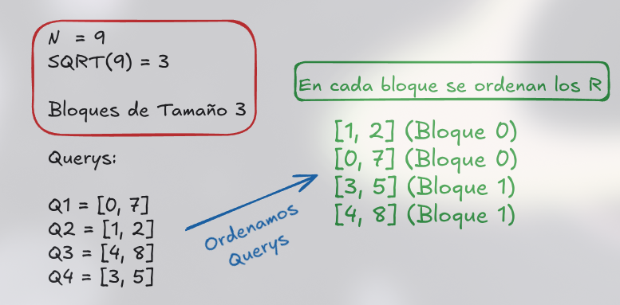

# Algoritmo de Mo

Imaginemos por un momento que nos dan muchas querys de tipo consulta en rangos de [L, R].

Es bien sabido que cuando miramos querys de este tipo es común pensar que podemos resolverlos con Segment Tree o algunos de sus derivados como el Segment Tree Lazy, Feenwick Tree, etc...


Pero no siempre es posible hacer estas consultas con segment tree ya que para que funcionara de manera correcta con segment tree tocaria usar un set por cada nodo para hacer la union correctamente, pero pensar de esa manera nos ocasionaria TLE o MLE por la cantidad de set y la union de estos mismos.

### Problema Clásico: Elementos distintos en arreglo (Querys)


**Se te da un arreglo de tamaño N y Q queries.**  
Cada query es del tipo [L, R] y debemos responder cuántos elementos distintos existen dentro de ese rango.

| Arreglo A | Consultas [L, R] y Resultados |
| --- | --- |
| **A = [1, 2, 1, 3, 2, 4, 1]**| • **[1, 4]**: [1, 2, 1, 3] $\rightarrow$ **3** elementos distintos <br> • **[2, 6]**: [2, 1, 3, 2, 4] $\rightarrow$ **4** elementos distintos <br> • **[3, 7]**: [1, 3, 2, 4, 1] $\rightarrow$ **4** elementos distintos |


--- 


## Definicion

**Lo que busca el algoritmo de MO'S es que los intervalos de [l, r] se muevan lo menos posibles entre querys.** 

## Casos de uso 

Mo's aplica a cualquier problema de queries en rango [L, R] donde la respuesta se pueda mantener incrementalmente insertando/quitando un elemento a la vez.


| Problema | `add`/`remove` |
| --- | --- |
| Elementos distintos en un rango | Un arreglo de frecuencias + un contador de valores con frecuencia > 0 |
| Elemento mas frecuente (moda) en un rango | Frecuencias + "frecuencia de frecuencias" |
| Mo's en arboles | Se aplana el arbol con un recorrido Euler y se trata como arreglo |

---

## Idea principal: Two Pointers + Sortings + SQRT

Si nos fijamos podemos tratar de agarrar cada query y empezar a **aumentar** o **disminur** el rango, por ejemplo:

Si tenemos las querys en un arrego de $$N = 5$$:
- $$[2, 3]$$
- $$[1, 4]$$
- $$[1, 5]$$

Lo que hariamos en una fuerza bruta seria algo como:

```cpp
set<int> st;

for(int i = l; i <= r; i++){
    st.insert(v[i]);    
}

```

La idea de usar dos punteros es que simplemente movamos los punteros para ahorrarnos volver a procesar otra vez ejemplo:

Procesamos **$$[l = 2, r = 3]$$**:

```cpp
setActual = {a[2], a[3]}
```

Pero ahora para la siguiente query no vamos a procesar de **0** otra vez, si no, vamos a ver la siguiente query que es $[1, 4]$.
 <br>
Como nuestros punteros estan en **2 y 3**, seria tan facil como disminuir el $L$ y aumentar el $R$ añadiendo ambas operaciones.

```cpp
setActual = {a[2], a[3], a[1], a[4]}
```

Tenemos en el set los dos anteriores y los dos actuales sin aumentar demasiado la complejidad.

Para la siguiete query un poco de lo mismo los punteros actuales estan en $L = 1, R = 4 $, la siguiente query es $[1, 5]$ entonces para no procesar otra vez podemos simplmente aumentar el $R$ a **5** y tener:

```cpp
setActual = {a[1], a[2], a[3], a[4], a[5]}
```

### Sorting Basico

Teniendo esto en cuenta podriamos decir que ordenando las $L$ seria suficiente, pero esto podria complicarse ya que todavia podrian existir casos donde el $L$ se mantenga de manera ordenada pero el $R$ cambie mucho, por ejemplo:

Tenemos las consultas

- $[1, 100.000]$
- $[2, 1]$
- $[3, 100.000]$


El puntero en $L$ se mantiene, sin embargo el puntero el $R$ cambia mucho, primero que todo va hasta la posicicion $100.000$, despues se devuelve a la posicion $1$ y despues se devuelve a la posición $100.000$, nos damos cuenta que esto no es lo mas eficiente del mundo...


### La clave del SQRT (Descomposicion de bloques) + Sorting (Bueno)

Como ya sabemos en la descomposicion de SQRT nos permite descomponer en bloques de tamaño de raiz cuadrada, esto es justo lo que necesitamos, ya que podemos ordenar los indices $L$ por bloques y ademas en cada bloque ordenar por $R$


En el peor de los casos $R$ recorre todo el arreglo de izquierda a derecha ($N$ pasos) una sola vez por cada bloque, como hay aproximadamente $\sqrt{N}$ bloques, el movimiento total de $R$ en todo el programa está acotado por: $$\mathcal{O}(N\sqrt{N})$$

---



---


## Implementacion de MO'S


```cpp
#include <bits/stdc++.h>
using namespace std;

const int MAXV = 1e6 + 5;
int bloque_tam;

struct Query {
    int id, l, r;

    bool operator<(const Query& other) const {
        int b1 = l / bloque_tam;
        int b2 = other.l / bloque_tam;

        if (b1 != b2)
            return b1 < b2; // ordenar por el bloque de L

        // dentro del mismo bloque, ordenamos por R
        // (alternar el sentido en bloques impares para evitar
        // que R retroceda bruscamente al cambiar de bloque)
        return (b1 % 2 == 0) ? (r < other.r) : (r > other.r);
    }
};

vector<int> v;
int freq[MAXV];
int contador_diferentes = 0;

void add(int idx) {
    int val = v[idx];
    if (freq[val] == 0) contador_diferentes++;
    freq[val]++;
}

void del(int idx) { 
    int val = v[idx];
    freq[val]--;
    if (freq[val] == 0) contador_diferentes--;
}

int main() {
    int n, q;
    cin >> n >> q;
    v.resize(n);

    for(auto &i : v) cin >> i;

    bloque_tam = max(1, (int)sqrt(n));

    vector<Query> queries(q);

    for(int i = 0; i < q; i++){
        cin >> queries[i].l >> queries[i].r;
        queries[i].l--; queries[i].r--; // indexar a  0
        queries[i].id = i;
    }

    sort(all(querys));

    vector<int> ans(q);
    int cl = 0, cr = -1; // ventana actual [cl, cr]

    for(auto &qr : queries){
        while (cr < qr.r) add(++cr);
        while (cl > qr.l) add(--cl);
        while (cr > qr.r) del(cr--);
        while (cl < qr.l) del(cl++);
        ans[qr.id] = contador_diferentes;
    }

    for(int i = 0; i < q; i++) cout << ans[i] << "\n";
}
```


## Explicación código 

La parte central que faltaba explicar es **para qué sirven `add` y `remove`**:

- `add(idx)` inserta el elemento en la posición `idx` a la ventana actual y actualiza la respuesta parcial. En el ejemplo, si `freq[val]` era 0, significa que ese valor no estaba en el rango, por lo cual sumariamos elemento distinto mas.
- `erase(idx)` (equivalente al "remove" de la explicación) hace lo contrario, quita el elemento de la ventana y si su frecuencia llega a 0, significa que ya no queda ningún elemento con ese valor en el rango por lo cual restariamos uno al contador de distintos.

En la parte **Final** cuando hacemos el movimiento de los punteros se puede observar mejor en la siguiente tabla:

| While | Condicion | Movimiento Puntero | Operacion |
|---|---|---|---|
| `(cr < qr.r)` | `cr` esta a la **izquierda** del final deseado | Mueve `cr` hacia la derecha (`++cr`) | **`add`** |
| `(cl > qr.l)` | `cl` esta a la **derecha** del inicio deseado | Mueve `cl` hacia la izquierda (`--cl`) | **`add`** |
| `(cr > qr.r)` | `cr` esta mas a la **derecha** de lo necesario | Mueve `cr` hacia la izquierda (`cr--`) | **`del`** |
| `(cl < qr.l)` | `cl` esta mas a la **izquierda** de lo necesario | Mueve `cl` hacia la derecha (`cl++`) | **`del`** |


## Restricciones

Para que esto funcione, `add`/`erase` deben ser **inversas exactas** una de la otra, si insertas y luego quitas el mismo elemento, el estado debe quedar exactamente igual que antes, por esta razon Mo's funciona muy bien para cosas como conteo de distintos, sumas o XOR, pero no aplica directamente hayar el minimo o maximo de rango ya que quitar el máximo actual no te dice cuál es el siguiente máximo en O(1).


- Solo funciona con querys **offline** necesitas tener todas las queries antes de procesar, ya que se van a reordenar.
- El arreglo debe ser **estatico** (sin actualizaciones) al menos de que se use la version de MO'S con actualizaciones.
- `add` y `remove` deben ser **operaciones reversibles y baratas** (idealmente O(1)), si no se puede actualizar de forma barata, MO'S no es una buena opcion.
- La complejidad O((N+Q)√N) asume que `add`/`remove` son O(1), si son O(log N), la complejidad sube a O((N+Q)√N log N), lo cual puede no pasar el limite de tiempo si N y Q son grandes.

