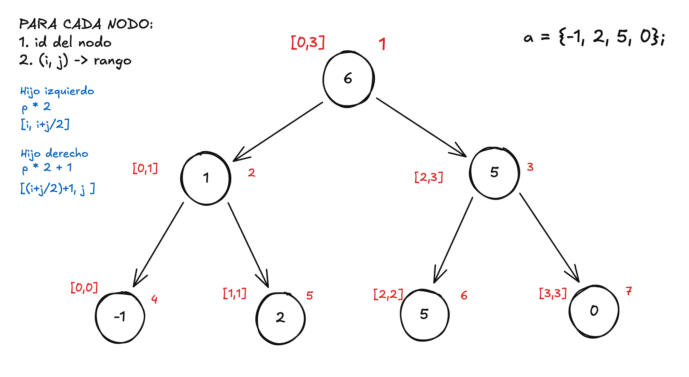
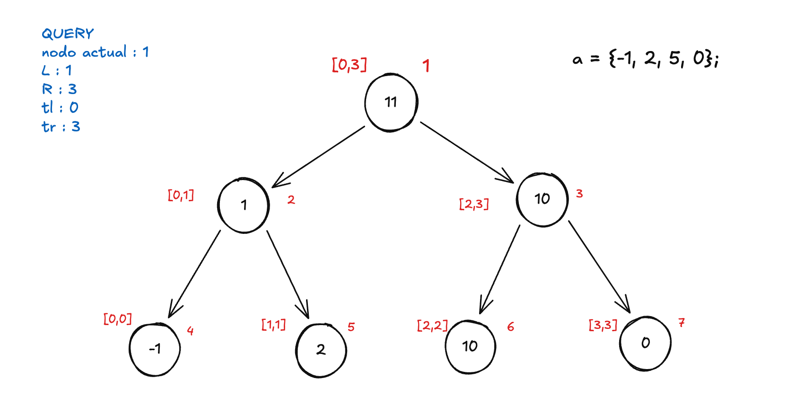
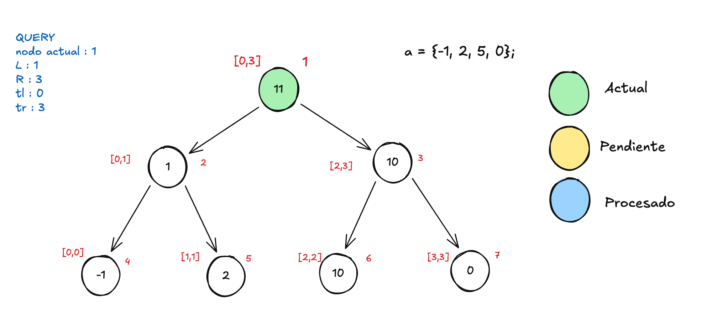
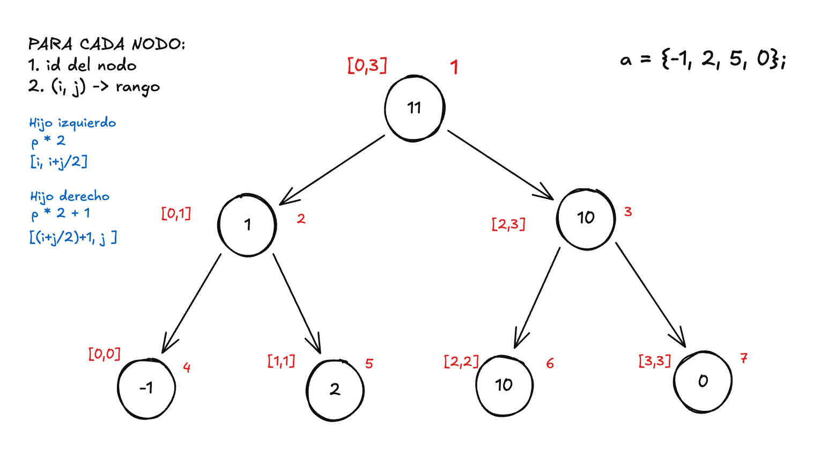
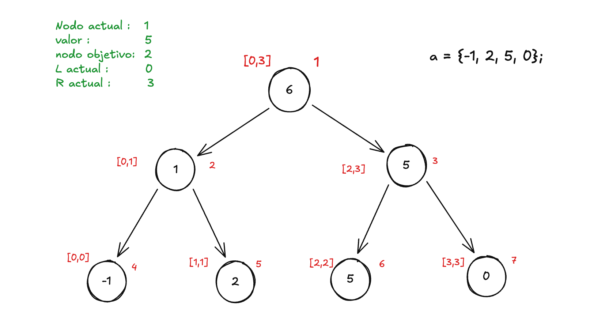
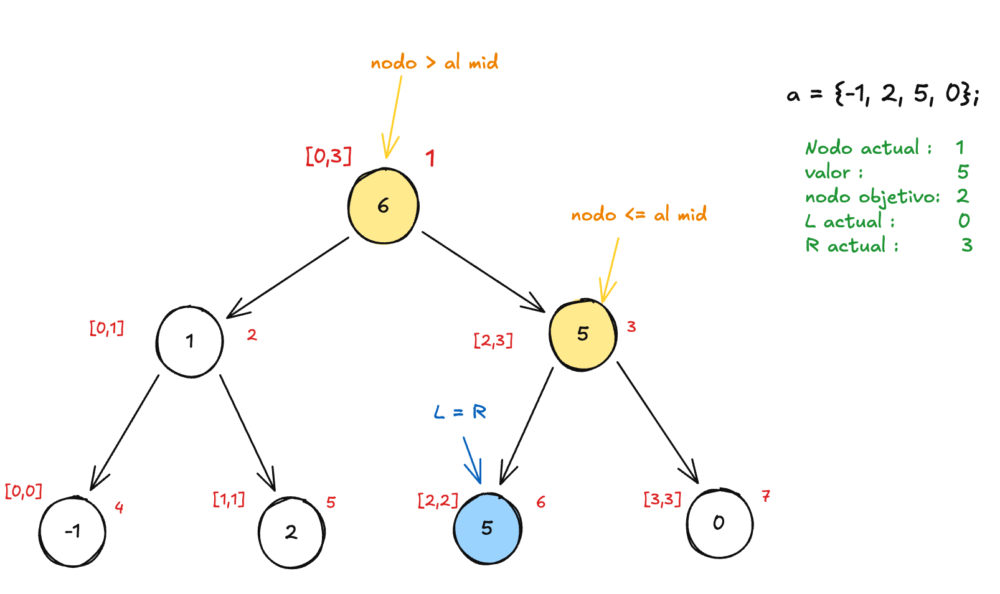
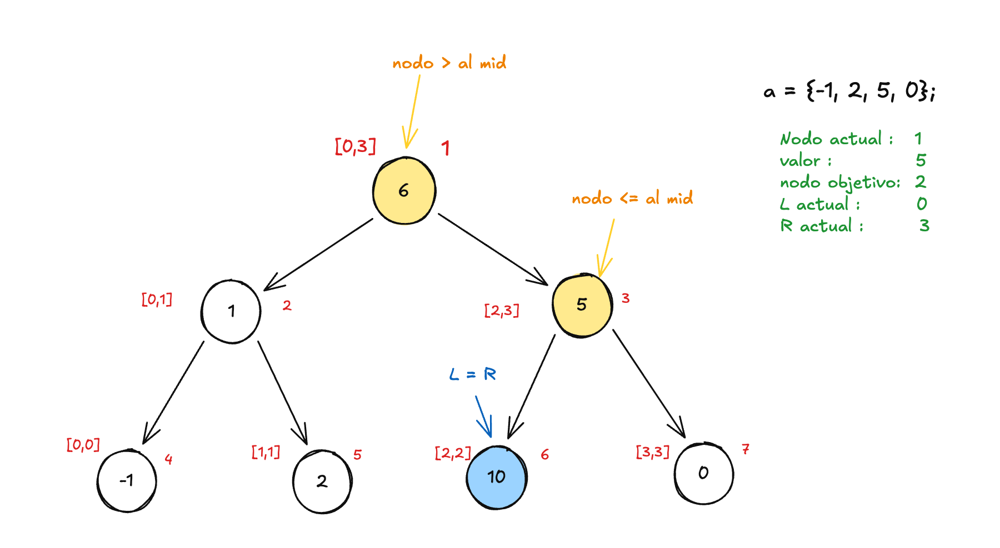
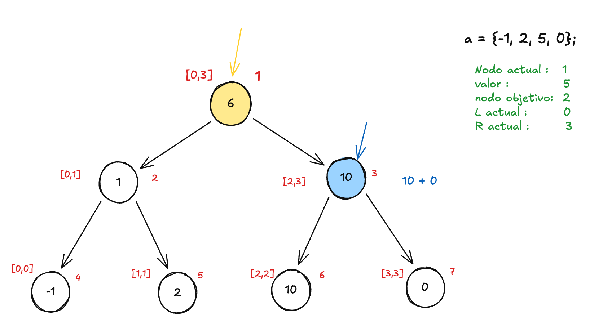
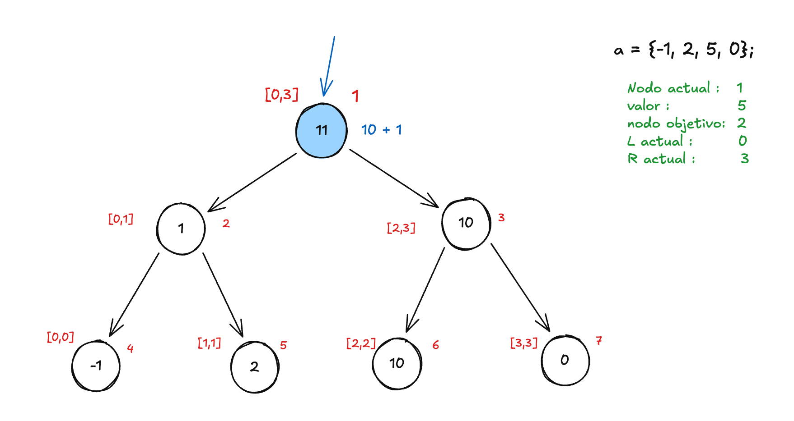

El segment tree es un albol binario que se nos presenta como la solucion cuando tenemos un conjunto de elementos y se requiere hacer queries en rango y actualizaciones sobre estos.

## ¿Cuando utilizar el segmentTree? - Generalizaciones
* Cuando tenemos un conjunto S, como lo seria el de los numeros enteros
* Requerimos hacer operaciones binarias con propiedades asocitavas: suma, multiplicación, maximo o minimo
* Contamos con un elemento neutro, en la suma es el numero cero

Para mayor entendimiento de este algoritmo trabajaremos con **_el array de numero enteros y con la operación de suma_**
```
a = {-1, 2, 5, 0};
```
La explicación de este algoritmo la divideremos en 3 partes: 
* Su construcción
* Su consulta en rango
* Su actualización

## Construcción del segment tree

Ya que hablamos de un arbol binario, podemos decir que un segment tree tendria esta forma a la hora de construirlo; en este algoritmo cada nodo tiene 2 atributos indispensables para su funcionamiento: un id para identidificar cada nodo y un tupla (i,j) que nos indica el rango que aquel nodo maneja.


Ahora bien ¿Comó introducimos nuestro array de numeros en el? arrancaremos desde la raiz de nuestro arbol, dando como indice el numero 1, ya que es el nodo 1 y la tupla  (0,3) que es el rango completo de nuestro array. 


Ya con los atributos de nuestra raiz, podemos pasar a calcular su valor. Pero, para esto es necesario calcular sus hijos primero, para ello le daremos los atributos de sus hijos de la siguiente manera:
* el ID del hijo izquierdo = id del padre * 2
* el ID del hijo derecho = id del padre * 2 + 1
* El rango del hijo izquierdo = [el i del padre, (i + j) / 2]
* El rango del hijo derecho = [(i + j) / 2 + 1, el J del padre]


Como los hijos directos del la raiz tampoco tienen ningun valor todavia, ellos tienen que calcular tambien el valor de sus hijos primero. La condicion de parada en esta recursión es cuando el i,j son iguales y como se puede apreciar esto solo ocurre cuando es una hoja. Las hojas indican el indice del valor en nuestro array con el que se tiene que llenar, una vez esto suceda se puede empezar a retornar la recursión y por ende calcular todos los nodos y ahi pa' arriba **sabiendo que en este caso un nodo padre es igual a la suma de los valores de sus hijos**.

Sabemos que las hojas se llenarán con los valores del array, los demas nodos tendrán que calcular primero sus hijos y su valor en este caso que estamos trabajando con suma será: 

````
arbol[nodo] = arbol[hijoIzq] + arbol[hijoDer]
````



## Query en rago dentro del arbol

Una vez construido el arbol, podemos hacer consultas en rango, es decir: dada una consulta (l, r) queremos saber la suma de todos los elementos entre esas dos posiciones.
Para ello recorremos el arbol desde la raiz, y en cada nodo evaluamos 3 posibles casos con respecto al rango del nodo actual (tl, tr) y el rango de la consulta (l, r):

* Cubierto completo: el rango del nodo esta completamente dentro de la consulta, es decir **_l <= tl && r >= tr_**. En este caso retornamos directamente el valor del nodo, no necesitamos bajar mas.
* Sin intersección: el rango del nodo esta completamente fuera de la consulta, es decir **_l > tr || r < tl_** . En este caso retornamos el elemento neutro, que para la suma es 0.
* Intersección parcial: el rango del nodo se cruza parcialmente con la consulta. En este caso bajamos a ambos hijos y combinamos sus resultados.

Para hacer la query necesitamos los siguientes parametros 

* nodo actual
* L y R: rango de la consulta -> Valores inmutables
* tl y tr: rango del nodo actual

#### Ejemplo
_Al igual que los demas metodos, iniciamos desde la raiz_


_La raiz cae en el ultimo caso que es interseccion parcial, por ende su resultado en la query sera el valor de la query de sus hijos_




## Actualización de nodos 

Antes de iniciar debemos aclarar que la actualización en el segment Tree tradicional solo permite actualizar posiciones en especificos, si un problema nos requiere las consultas por rangos y las actualizaciones tambien, la mejor implementación seria el segment Tree Laz. Dicho esto, podemos aclarar que la actualizacíon en un nodo es reemplazar su valor o hacerle una operación con un valor x, es decir: queremos actualizar la posición 2 con el valor de 5. Actualmente ese nodo tiene un valor de 2, por lo que en la actualización se nos permite reemplazar su valor por 5 o a alguna operación como seria sumarle 5; Si la operación es esta ultima terminariamos con un arbol asi: 



Pero, ahora bien ¿Como se produce esta actualziación? Para ello debemos de crear otro metodo en el struct donde nos importa pasarle los siguientes valores 

* Nodo actual
* Valor con el que vamos a actualizar
* Nodo que queremos actualizar 
* L y R del nodo actual

Como sabemos, el nodo en el que iniciaremos sera en la raiz de nuestro arbol, y el L y R que le daremos será el rango de este. 



La condicion de parada será la misma que en la construcción del arbol, cuando el. L y R seán iguales aplicaremos la actualización, de otra forma haremos lo siguiente: 

* Si el nodo a actualizar es menor igual al mid  del rango actual, mandaremos a actualizar al hijo izquierdo

* Si el nodo es estrictamente mayor al mid, madamaremos a actualizar al hijo derecho 

* una vez termine la recursion de alguno de los hijos actualzimos el nodo actual con el nuevo valores de sus hijos.



Una vez que hallamos el nodo, retornamos la recursión hasta la raiz 






````cpp
struct SegmentTree { 
  int size;
  ll neutro = 0; // OPERADOR NEUTRO PARA LA SUMA
  vi tree;

  SegmentTree(vi &a){
    size = sz(a);
    tree.assign(size*4, 0); // CAMBIAR AQUI TAMBIEN EL NEUTRO
    build(1, 0, size-1, a);
  }

  void build (int v, int tl, int tr, vi &a){
    if(tl == tr){
      tree[v] = a[tl];
      return;
    }

    int mid = (tl+tr)/2;

    // build a mi hijo izquierdo
    build(v*2, tl, mid, a);

    // build a mi hijo derecho
    build(v*2 + 1, mid + 1, tr, a);

    tree[v] = tree[v*2] + tree[v*2+1];
  }

  void show(){
    for(auto &i : tree){
      cout << i << endl;
    }
  }

  ll query(int v, int l, int r, int tl, int tr){
    if(l <= tl && r >= tr){
      return tree[v];
    }
    if(r < tl || l > tr){
      return neutro;
    }

    int mid = (tl + tr)/2;

    ll hijoIzq = query(v*2, l, r, tl, mid);
    ll hijoDer = query(v*2+1, l, r, mid+1, tr);

    return hijoIzq + hijoDer;
    
  }

  ll query(int l, int r){
    return query(1, l, r, 0, size-1);
  }


  void updt(int v, int tl, int tr, int k, ll x){

    if(tl == tr){
      tree[v] = x;
      return;
    }
    int mid = (tl+tr)/2;

    if(k <= mid){ // actualizar hijo izquierdo
      updt(v*2, tl, mid, k, x);
    }else{        // actualizar hijo derecho
      updt(v*2+1, mid+1, tr, k, x);
    }
   
    tree[v] = tree[v*2] + tree[v*2+1];
    
  }

  void updt(int k, ll x){
    updt(1, 0, size-1, k, x);
  }


};
````