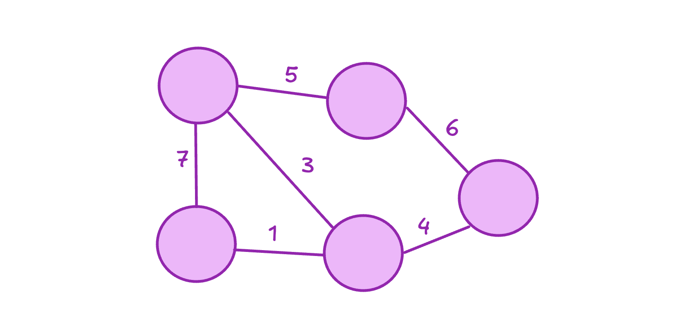

## Planteamiento del problema 
Imagina que hay un pequeño pueblo que se esta construyendo a las afueras de una gran ciudad llamada NlogNia, los nuevos pobladores del nuevo pueblito les interesa mucho poder tener agua. Por ello, A lo primero que les intereso solucionar antes de inciiar con sus nuevos hogares fue el sistema de tuberias por donde pasaria el agua. El problema es que el fabricante mas cercano vende tuberias de diferentes tamaños de diametro, esto resulta ser un problema si queremos que el agua fluya la misma cantidad por toda la red. Pero, al no tener mas opción, los pobladores compraron las que pudieron, dando como resultado el siguiente plano estructural.

En la imagen que se te acaba de mostrar representa esa red de tuberias, las aristas son aquellas tuberias y el valor al lado es su diametro, los nodos son esos puntos de conexión entre las diferentes tuberias que los pobladores pudieron comprar. Ahora se les presenta un problema, El agua se las suministrará esa gran ciudad que tienen de vecinos y se la cobraran a cierto precio. Como buenos colombianos, los pobladores no se fian que le cobren lo que realmente gastán y es por ello que quieren descubrir realmente cuanta agua soportaria la red. Si fueras el ingeniero encargado de esta tarea ¿Que harías?

## Definición

## Explicación algoritmo Edmonds Karp

## Codigo 
