## Planteamiento del problema 
Imagina que se esta construyendo un pequeño pueblo a las afueras de una gran ciudad llamada NlogNia, los nuevos pobladores del nuevo pueblito les interesa mucho poder tener agua. Por ello, A lo primero que les intereso solucionar antes de inciar con sus nuevos hogares fue el sistema de tuberias por donde pasaria el agua. El problema es que la fabrica mas cercano solo vende tuberias de diferentes tamaños de diametro, esto resulta ser un problema si queremos que fluya la misma cantidad de agua por toda la red. Pero, al no tener mas opción, los pobladores compraron las que pudieron, dando como resultado el siguiente plano estructural.

En la imagen que se te acaba de mostrar representa esa red de tuberias, las aristas (palitos) son aquellas tuberias y el valor al lado es su diametro, los nodos (circulos) son esos puntos de conexión entre las diferentes tuberias instaladas en el pueblito. Ahora se les presenta un nuevo problema, El agua se las suministrará esa gran ciudad que tienen de vecinos, y se la cobraran a cierto precio. ellos saben la cantidad de agua que consumen porque es igual a la cantidad de agua que llega al sumidero y como buenos colombianos, los pobladores no se fian que le cobren lo que realmente gastán y es por ello que quieren descubrir realmente cuanta agua soportaria la red. Si fueras el ingeniero encargado de esta tarea ¿Que harías?

## Definición

La explicación del problema anterior define especificamente lo que es un problema de flujo maximo, el cual se puede definir como: dado un grafo dirigido y ponderado, y con un nodo origen y un nodo final - sumidero, se quiere saber la cantidad maxima de agua/flujo que puede pasar desde el nodo s hasta el nodo t.

Para ello, en esta seccion explicaremos la implementación inicial de flujo maximo, el metodo de Ford fulkerson, hay que aclara que este metodo tiene varias implementaciones y es por ello que mostraremos la implemetación del algritmos de Edmonds karp la cual tiene un timpo de complejidad bastante aceptable de O(VE^2)

## Explicación algoritmo Edmonds Karp

Retomando el problema inicial, nos falta definir el nodo s y el nodo t. Para este ejemplo, tomaremos dos nodos ya existentes del grafo para que nos sirvan como origen y desague. -> Aqui falta como una aclaración o algo de como se nos da el problema normalmente

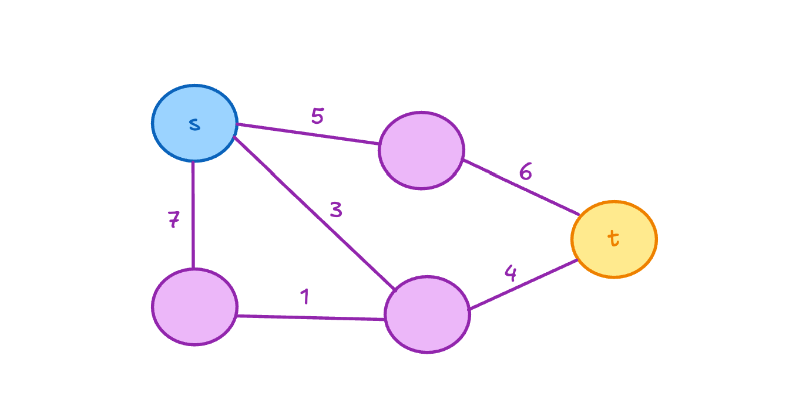

ya con el grafo preparado, podemos iniciar con el con el algoritmo, este utiliza las aritas en ambas direcciones, asi que primeramente, debemos de ilustrar el grafo con aristas dirigidas  

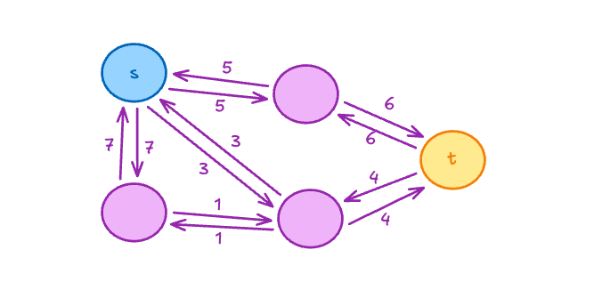

Ahora bien, el algoritmo funciona de la siguiente manera: 
1. buscar un camino, desde el nodo s hasta el nodo t, donde todas las aristas tenga peso positivo es decir diferente de 0
2. el valor mas pequeño del peso de todas las aristas, se le restara a todas las aristas, hacia adelante del camino
3. ese mismo valor se le añade a las aristas inversas del camino

con esto claro inciamos nuestra primera busqueda de camino en el nodo s

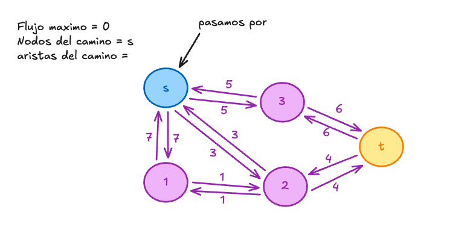

desde aqui, podemos saltar al nodo 3 con un peso de 5

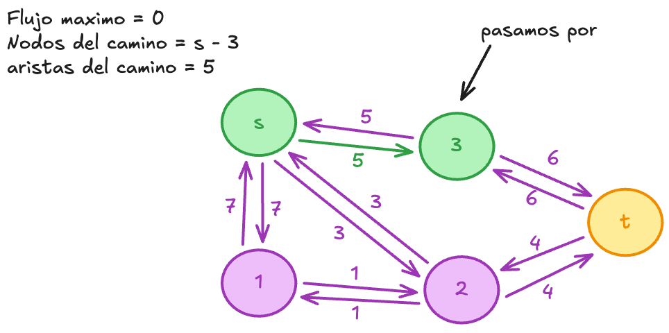

desde el nodo 3 se puede alcanzar directamente el nodo t con un peso de 6

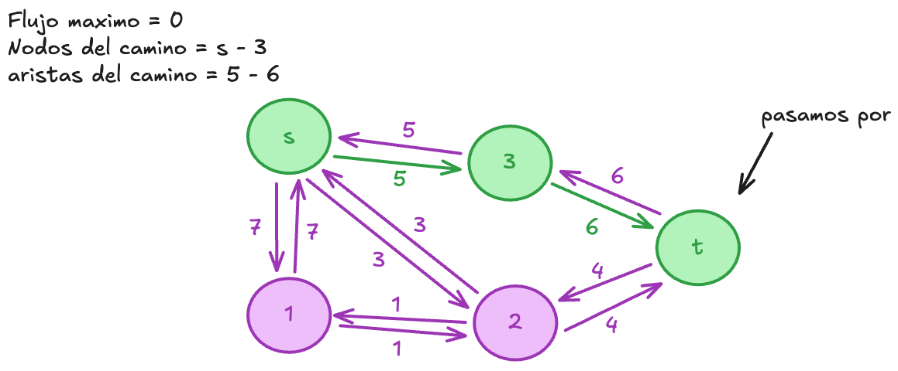

Ya que encontramos un camino debemos restar el valor de la arista más pequeña a todas las aristas utilizadas y sumando el mismo valor a sus contrarias

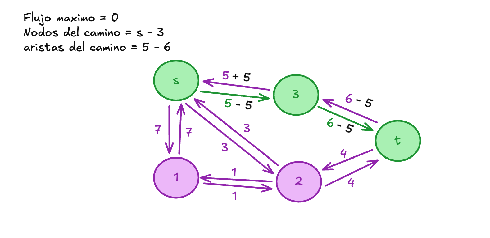

dandonos como resultados las siguientes aristas y teniendo por el momento un flujo maximo de 5

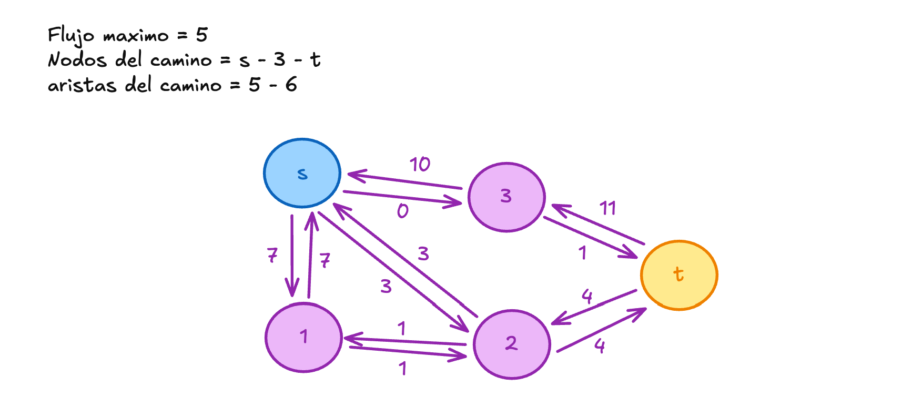

si seguimos con el algoritmo buscando otro camino,  nos daremos cuenta que ya no podemos pasar de s a 3 porque ya no tenemos una arista postivia, lo que nos toca pasar por 2 o por 1 y 2 para llegar a t, elegimos cualquiera de esos dos caminos posibles 

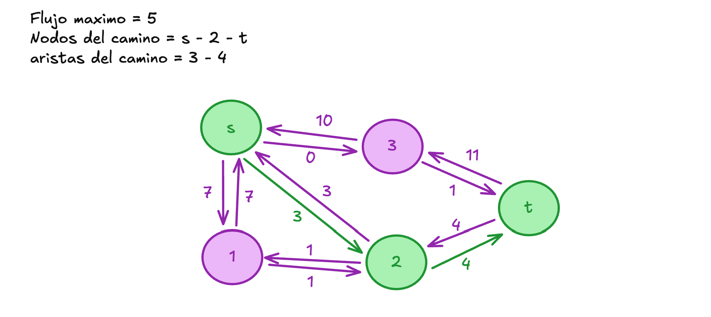

En este camino de s - 2 - t tenemos la arista con el menor valor de 3, lo que resulta en un flujo maximo actualizado de 8 y ya solo nos quedaria actualizar las aristas del camino restandoles ese valor y sumandoselo a sus opuestas. dandonos como resultado del siguiente grafo

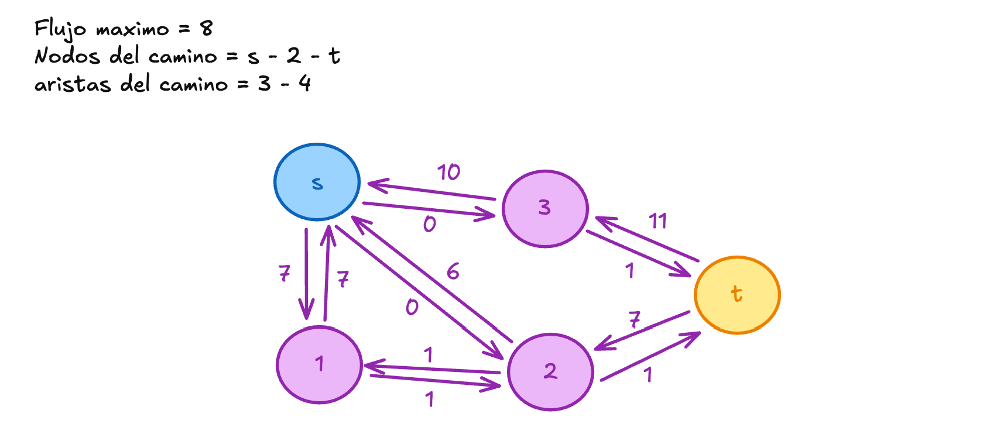

Por ultimo, nos queda dispinible el camino de s - 1 - 2 - t. como se muestra, este camino tiene como peso de minimo en sus aristas de 1

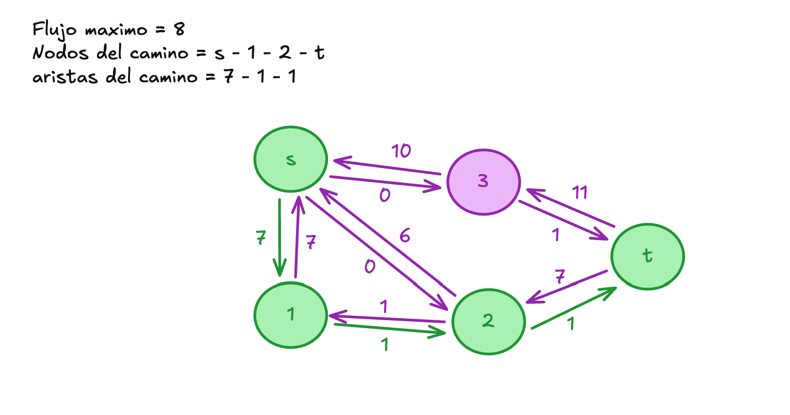

ya con esto claro, solo nos queda por actulizar las aristas del camino. dandonos un flujo maximo final de 9

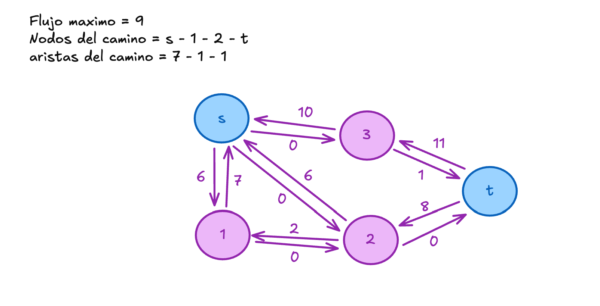

## Codigo 
