## Planteamiento del problema 

Supongamos que tenemos un grupo de $n$ estudiantes que quieren asistir a ciertos cursos intensivos dependiendo de sus gustos y las materias que les faltan por ver. Por temas de política de la universidad, los cursos intensivos son 1 a 1; es decir, cada curso intensivo está dirigido a un solo estudiante y solo hay un cupo por curso. Para este ejemplo, tendremos 2 estudiantes y 3 cursos ofertados: para el caso del primer estudiante, este está interesado en los 3 cursos. Por otro lado, el segundo estudiante esta interesando solo en el primer curso ofertado.

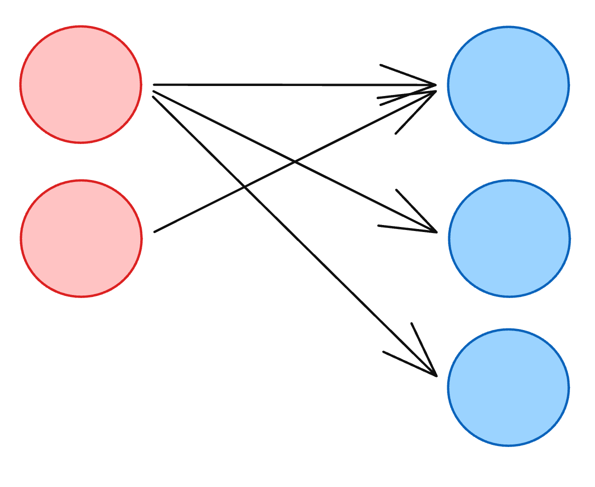

La universidad te pide ayuda para desarrollar un programa que logre emparejar a la mayor cantidad posible de estudiantes con sus cursos de interés. ¿Qué harías para lograrlo?

Podríamos intentar modelarlo como un algoritmo de flujo máximo, ya que sería lo primero que uno pensaría al leer sobre estos temas. Colocaríamos un nodo origen **$S$** conectado a todos los nodos del grupo de la izquierda (estudiantes), y un nodo sumidero **$T$** conectado a todos los nodos del grupo de la derecha (cursos).

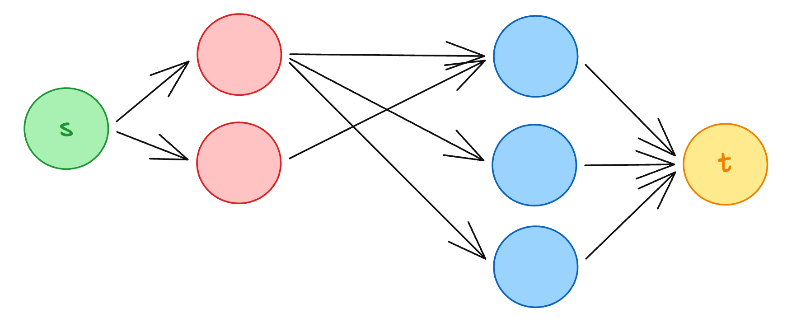

Con un grafo de este tipo, se podrían colocar capacidades de 1 en todas las aristas y correr un algoritmo de flujo máximo. Pero, ¿qué pasa si queremos saber exactamente quién quedó emparejado con qué curso? Además, los algoritmos tradicionales de flujo máximo pueden ser pesados, y en problemas de emparejamiento bipartito las cotas pueden ser muy altas, quebrando esta idea inicial. En el mejor de los casos, estaríamos hablando de una complejidad de $\mathcal{O}(V^2 \cdot E)$.

Es por esto que la solución ideal para este problema son los algoritmos de aumento de camino, como el Algoritmo de Kuhn o el Algoritmo de Hopcroft-Karp.

## Definición

Un **grafo bipartito** es simplemente un grafo que se puede dividir en dos grupos completamente separados, teniendo en cuenta que: los elementos del mismo grupo no pueden conectarse entre sí. Todas las conexiones deben ir de un grupo hacia el otro. En nuestro ejemplo inicial, un grupo son los **estudiantes** y el otro grupo son los **cursos**. Las conexiones solo existen entre un estudiante y un curso, NO es posible conectar estudiantes entre si o cursos entre si.

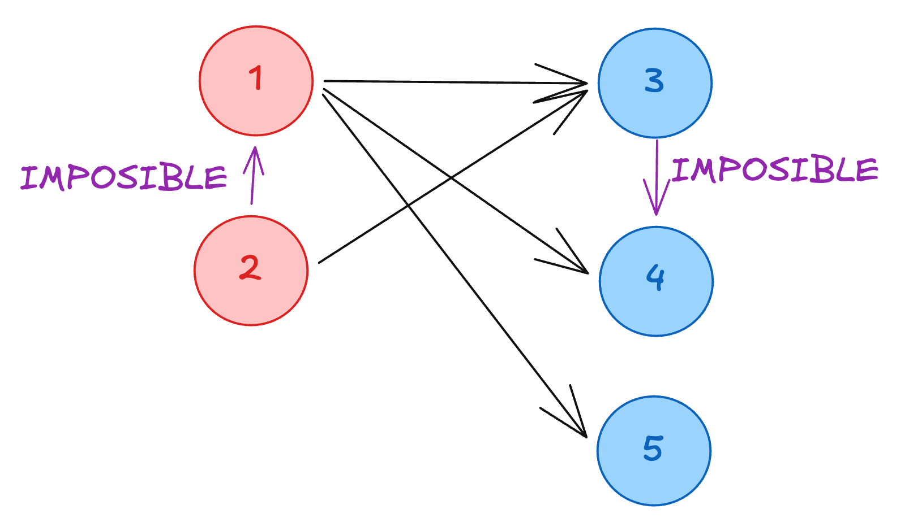

Un **emparejamiento** (*matching*) es exactamente lo que suena: armar parejas entre los dos grupos asegurándonos de exclusividad. Es decir, un estudiante solo puede tomar un curso, y un curso solo puede ser asignado a un estudiante. Ningún elemento puede compartir pareja.

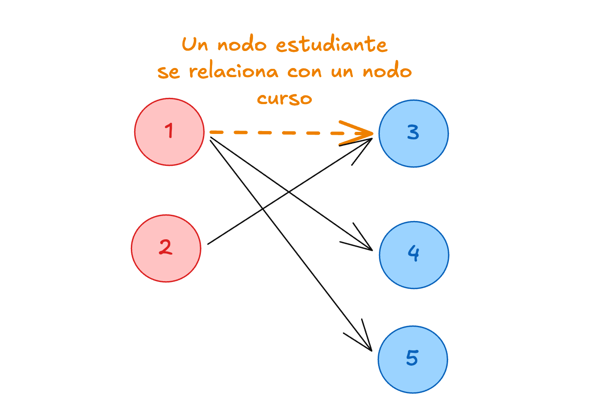

El **Emparejamiento Bipartito Máximo** (MCBM por sus siglas en inglés) es el reto de encontrar la combinación perfecta para armar estas parejas, de modo que la **mayor cantidad posible** de estudiantes consiga un curso.

Para resolver este problema existen varios algoritmos:

- **Algoritmo de Kuhn:** $\mathcal{O}(E \cdot V)$ -> Se basa en búsquedas en profundidad (DFS).
- **Algoritmo de Hopcroft-Karp:** $\mathcal{O}(E \cdot \sqrt{V})$ -> Optimización del algoritmo de Kuhn que usa BFS y DFS combinados.
- **Algoritmo Húngaro:** $\mathcal{O}(V^3)$ -> Utilizado generalmente cuando las aristas tienen pesos.

Esta sección abarcará el algoritmo de **Kuhn**, que es la base fundamental para entender cómo resolver estos problemas mediante el aumento de caminos.

## Explicación (Algoritmo de Kuhn)

La idea del **aumento de camino** es que el algoritmo intentará asignar una pareja a cada nodo libre de la izquierda. Si la pareja deseada en la derecha ya está ocupada, el algoritmo usará recursividad (un DFS) para pedirle al nodo que la está ocupando que intente buscar otra opción.

Veamos cómo funciona esto en sintonía con el código. Arrancamos en el nodo 1 de la izquierda. Su primera arista apunta al nodo 3 de la derecha. Como el nodo 3 está libre (`partner[u] == -1`), los emparejamos directamente.

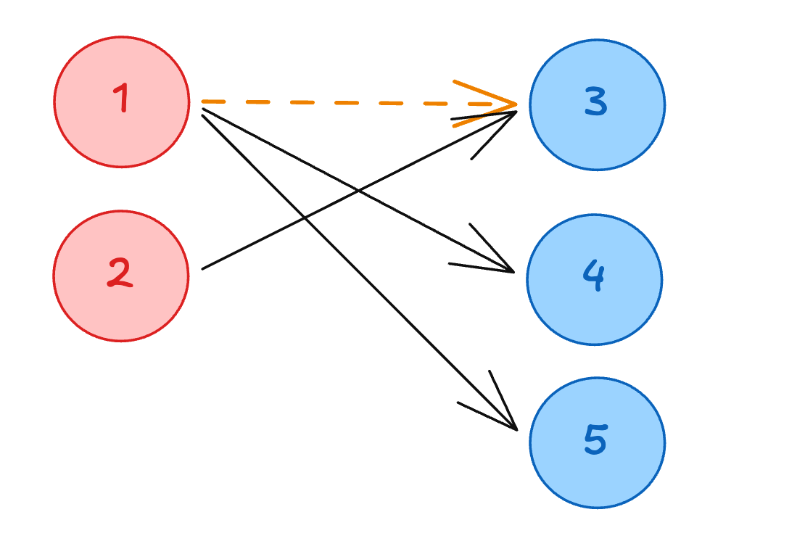

Como el emparejamiento del nodo 1 fue exitoso, el ciclo avanza al siguiente nodo libre de la izquierda: el nodo 2. 

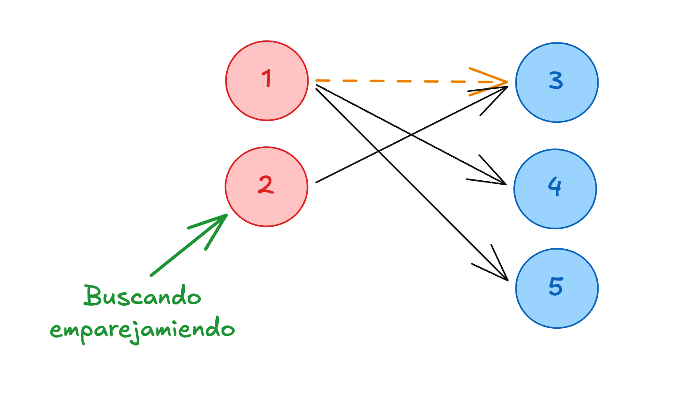

El nodo 2 intenta emparejarse con su primera conexión disponible, que es el nodo 3. Sin embargo, el nodo 3 ya está emparejado con el nodo 1. Aquí es donde entra la magia de la función recursiva: el código evalúa `matching(partner[u])`.

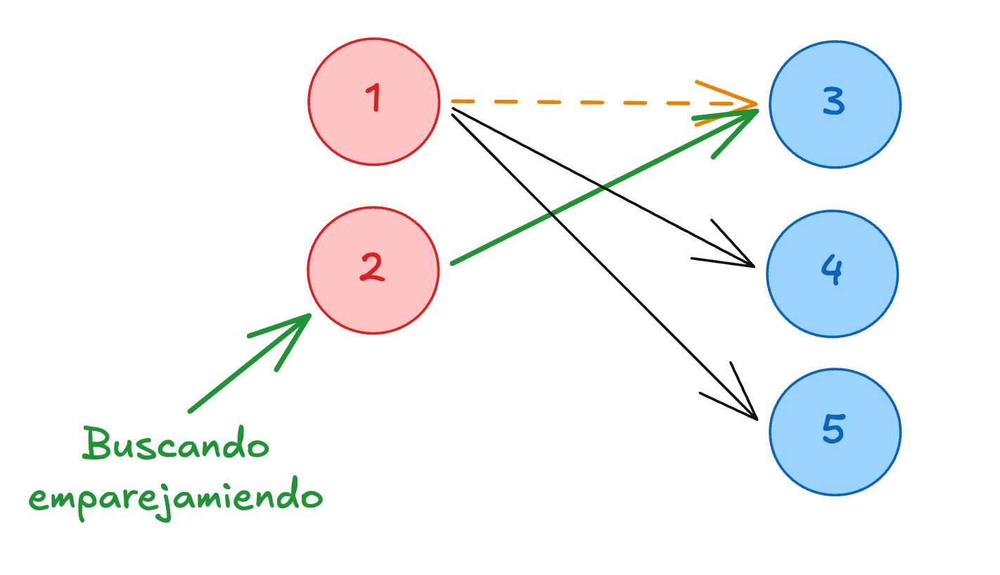

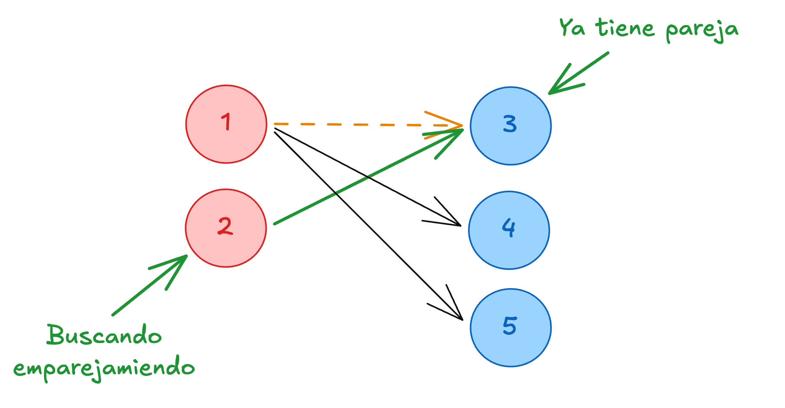

En lugar de rendirse, el algoritmo "salta" hacia atrás al nodo 1 (la pareja actual del nodo 3) para ver si puede encontrar un **camino de aumento**. Le pedimos al nodo 1 que busque otra opción disponible en su lista de adyacencia.

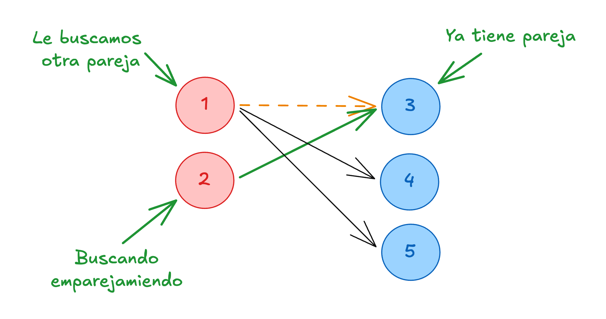

El nodo 1 revisa su siguiente arista y encuentra al nodo 4. Como el nodo 4 está completamente libre, el nodo 1 lo toma como su nueva pareja.

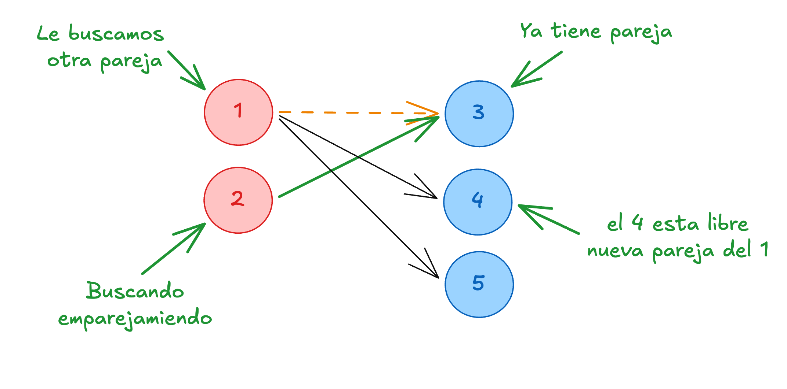

Al emparejarse el nodo 1 con el nodo 4, el vínculo anterior se rompe. 

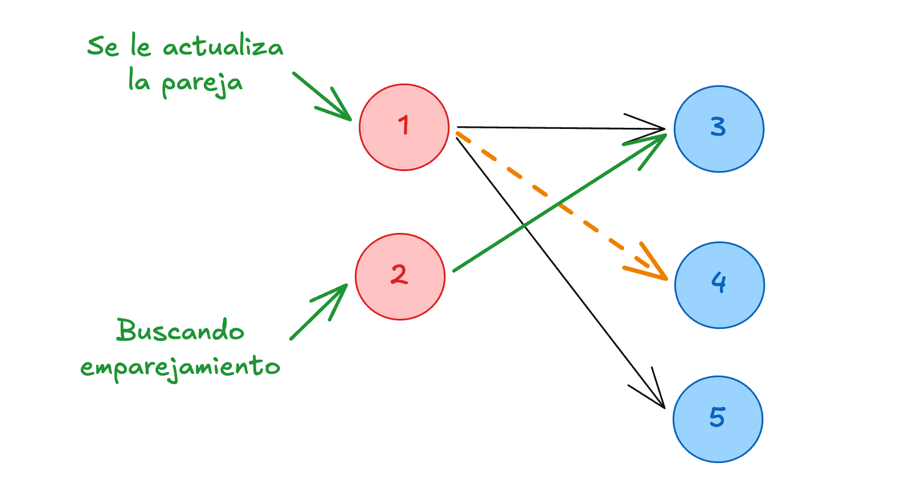

Como la llamada recursiva del nodo 1 retornó verdadero (`true`), el nodo 3 queda oficialmente liberado. El nodo 2, que estaba esperando esta respuesta, ahora puede reclamar al nodo 3 como su pareja.

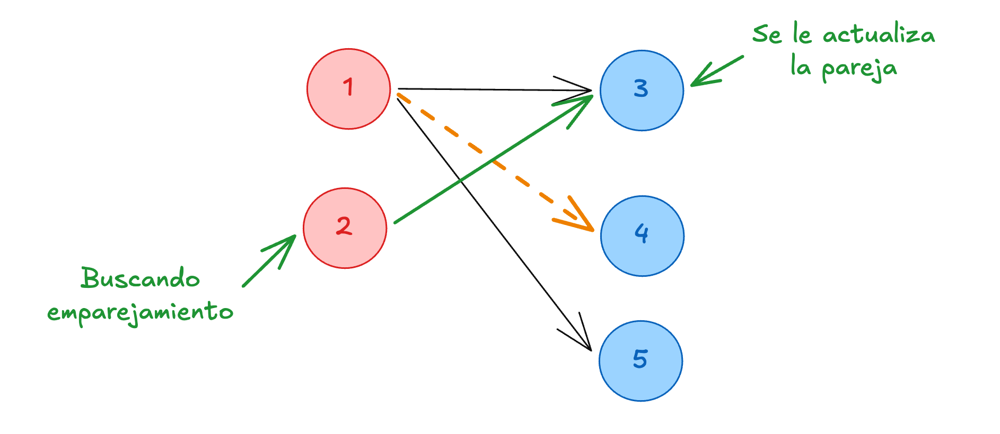

De esta forma, logramos reacomodar las asignaciones para aumentar la respuesta total. Pasamos de tener un solo emparejamiento a tener dos, demostrando la eficiencia del camino de aumento.

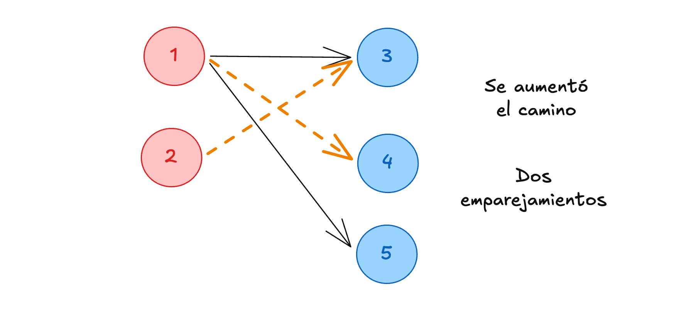

## Casos de uso

Los casos de uso para este algoritmo son fascinantes. Muchos problemas que aparentemente no tienen nada que ver con grafos pueden modelarse como problemas de emparejamiento bipartito. Como recomienda Steven Halim en su libro *Competitive Programming*, vale la pena dedicar tiempo significativo a desarrollar el pensamiento abstracto necesario para identificar estas propiedades en los enunciados y lograr modelarlos correctamente.

## Código

```cpp
// Complexity: O(V * E)
// Para problemas con tiempos más ajustados o grafos más grandes, usar Hopcroft-Karp O(E * sqrt(V))

struct mbm {
  int l, r;
  vector<int> partner;          // Almacena la pareja izquierda del nodo derecho
  vector<bool> vs;              // Nodos visitados en la iteración actual del DFS
  vector<vector<int> > ady; 

  mbm(int l, int r) : l(l), r(r), partner(r), vs(l), ady(l) {}

  // Intenta encontrar un camino de aumento para el nodo v
  bool matching(int v) {
    if (vs[v]) return false;
    vs[v] = true;
    for (int &u : ady[v]) {
      // Si el nodo derecho 'u' está libre, O SI su pareja actual puede buscar otra opción
      if (partner[u] == -1 || matching(partner[u])) {
        partner[u] = v; // Se establece el emparejamiento
        return true;
      }
    }
    return false;
  }

  vector<pair<int, int> > go_matching() {   
    vector<pair<int, int> > ans;
    fill(all(partner), -1); // Inicialmente, ningún nodo derecho tiene pareja
    
    // Intentamos emparejar cada nodo de la izquierda
    forn (i, l) {
      fill(all(vs), false); // Reiniciamos los visitados para el DFS de cada nodo
      matching(i);
    }
    
    // Recopilamos las respuestas
    forn (i, r) {
      if (partner[i] != -1) {
        ans.pb({partner[i], i});
      }
    }
    return ans;
  }
};