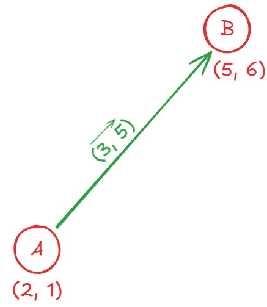
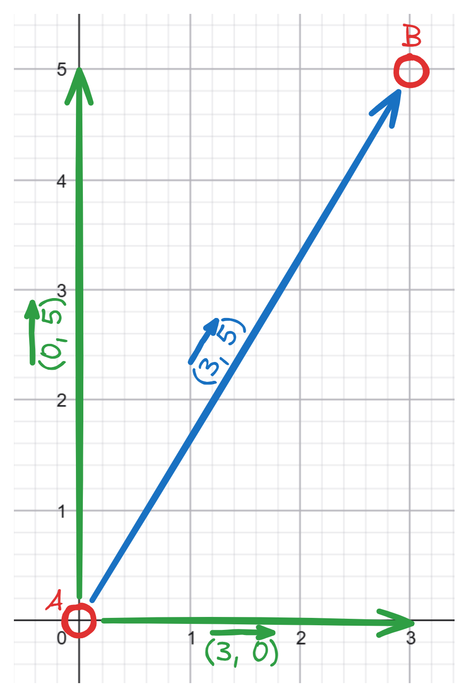
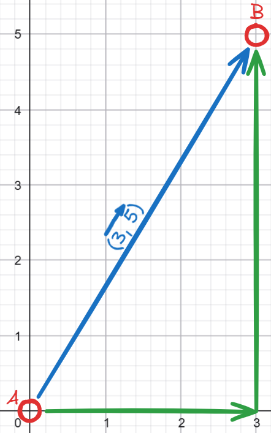
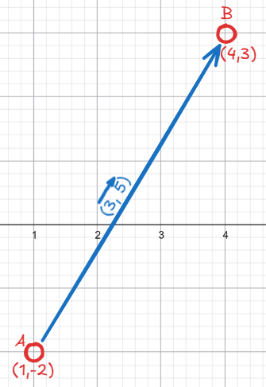
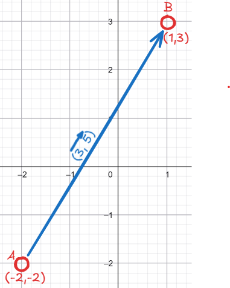
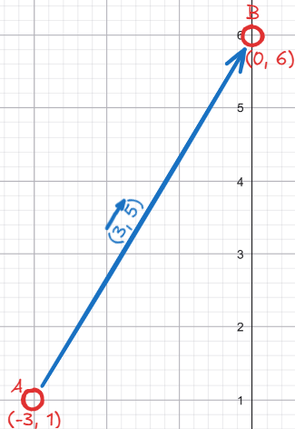
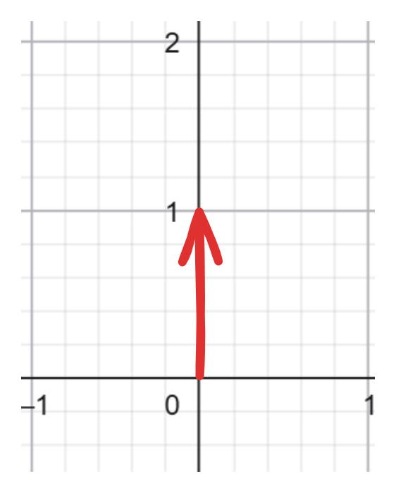

## Planteamiento del problema que soluciona

Imagina que quieres decirle a alguién como llegar de un poste de luz a un árbol en un parque. Podrías decir "camina 3 metros hacia la derecha y 5 metros hacia delante". Esa instrucción tiene dos partes: una de posicion de inicio (el poste) y un desplazamiento (3 a la derecha, 5 adelante). En geometría necesitamos una forma de guardar y trabajar con ambas cosas - la posición fija de algo, y el desplazamiento entre dos posiciones - antes de poder resolver cualquier problema mas complejo.

>**Nota sobre el nombre "vector":** en este contexto, "vector" **no** tiene nada que ver con el `vector` de c++ (esa estructura dinámica de tipo lista que probablemente ya conoces de programación). Tampoco hace falta saber algebra lineal para entender este tema. Aquí, "vector" es simplemente el nombre que se le da en geometría a **un desplazamiento**: cuánto te mueves horizontalmente y cuanto te mueves verticalmente para ir de un lugar a otro. Es una idea sencilla, no un concepto matemático avanzado.

**Ejmplo concreto:** Si el poste está en la posición `(2, 1)` y en el árbol está en `(5, 6)`, el desplazamiento del (vector) para ir de uno al otro es `(5 - 2, 6 - 1) = (3, 5)`: 3 unidades a la derecha, 5 hacia delante. Ese par `(3, 5)` es el "vector", y no es más que la resta de dos posiciones.


---
## Explicación de requisitos

Este es un tema base: no depende de ningún otro tema de geometría. Lo unico que hace falta es aritmetica básica (suma, resta, multiplicación) y, si se requiere, conocimientos generales de structs/clases del lenguaje que se esté usando.

---
## Definición

Un **vector**, como ya se explicó arriba, no es una posición sino un **desplazamiento**: cuánto te mueves en `X` y cuánto en `Y` para ir de un lugar a otro. También se guarda como un par `(X, Y)`, pero su significado es distinto al de un punto: un punto es "dónde estoy", un vector es "hacia dónde y cuánto me muevo".
 
Si tienes dos puntos `A` y `B`, el vector para ir de `A` a `B` se obtiene restando sus coordenadas:
 
```
vector_AB = (B.x - A.x, B.y - A.y)
```
 
**¿Por qué un punto y un vector se ven exactamente igual?**
 
Porque un vector representa únicamente una **magnitud** (qué tan largo es) y una **dirección** (hacia dónde apunta) — nada más. Si dibujas ese vector partiendo del origen `(0, 0)`, el punto al que llegas es numéricamente igual al vector: por eso `(3, 5)` puede leerse como punto o como vector, dependiendo del contexto.
 


 
**Aplicar un vector a un punto**
 
Como el vector no está atado a los puntos `A` o `B`, se puede aplicar a cualquier punto de partida sumándolo:
 
```
Punto_A + vector_AB = Punto_B
(2, 1) + (3, 5) = (5, 6)
```
 
Esta es la relación clave: **restar** dos puntos te da el vector entre ellos, y **sumar** un vector a un punto te da otro punto (el resultado de aplicar ese desplazamiento).
 



---

## Casos de uso

* Base para representar cualquier figura geométrica: segmentos, poligonos, círculos, etc.
* Necesario para calcular desplazamientos, distancias, y direcciones entre posiciones.
* Prerequisito director del producto cruz y del producto punto, que se calculan sobre vectores.
* Prerequisito para el convex hull y, en general para casi cualquier tema de geometría computacional.

---


**Representación de un punto**

Un punto se representa guardando sus coordenadas juntas, en vez de manejarlas como variables sueltas. Esto permite pasar "un punto" como una sola unidad a las funciones, en vez de pasar `x` e `y` por separado.

```
struct pt {
    int x, y;
}
```
***Representación de un vector**

Un vector se presenta exactamente igual que un punto (dos números, `x` e `y`), pero se obtiene normalmente de una de estas formas:
1. **Restando dos puntos:** `vector = B-A`, lo que da la dirección y magnitud para ir de `A` a `B`.
2. **Directamente**, cuando el vector no representa un desplazamiento entre puntos concretos sino una dirección abstracta (por ejemplo, "hacia arriba" sería el vector `(0, 1)`).


**Operaciones básicas que se definen sobre esta representación**

Una vez está definida la estructura de un punto/vector, se definen operaciones que todos los temas posteriores van a usar:
- **Suma de vectores - "¿a donde llego si aplico dos desplazamientos seguidos?":** `(a.x + b.x, a.y + b.y)`  Si te mueves según el vector `A` y luego según el vector `B`, la suma `A + B` te da el desplazamiento total equivalente a hacer ambos movimientos uno tras otro. Tambien es la operación que usas para **aplicar un vector a un punto** (como vimos arriba: `punto + vector = otro punto`), que es como mueves un punto en una dirección específica - por ejemplo, mover un objeto en un juego, o encontrar dónde termina un jugador después de caminar en cierta dirección.  **Imagen 8[]**
- **resta de vectores/puntos - dos preguntas distintias según qué le restes a qué:** `(a.x - b.x, a.y - b.y)` Esta es la que más se presta a confusión porque la misma fórmula responde a dos preguntas diferentes dependiendo de que estés restando:
    - **(Punto-Punto) → vector.**  Si restas dos *puntos* (posiciones), el resultado es el *vector* que va de un punto al otro.
    Es la oriencaión que usamos en el ejemplo del poste y el árbol: `B - A` te dice "que desplazamiento becesito hacer para ir de `A` hacia `B`". Esta es, por lejos, la forma más común en la que vas a usar la resta en geometría: casi cualquier algoritmo que compara posiciones (¿`A` y `B` están cerca?, ¿en qué dirección está `B` respecto a `A`?) empieza restando dos puntos para obtener un vector con el que trabajar. **Imagen 9[]**
    - **(Vector-Vector) → vector.** Si restas dos *vectores* (dos desplazzamientos), el resultado es la diferencia entre esas dos direcciones/magnitudes - útil, por ejmplo, para saber cuánto cambió la velocidad o dirección de algo entre dos momentos, pero en geometría computacional aparece con menos frecuencia que el caso anterior. **Imagen 10[]**

    >La fórmula es idéntica en ambos casos; lo que cambia es cómo interpretas el resultado según si lo que restaste eran posiciones o desplazamientos. Por eso es tan importante tener claro desde el principio la diferencia conceptual entre punto y vector que vimos más arriba - sin eso, es fácil perderse en qué significa cada resta.

- **Multiplicación por escalar "¿Cómo hago un vector más largo, más corto, o invierto su dirección?":** `(a.x * k, a.y * k)` Multiplicar un vector por su número `k` alarga o encoge el vector sin cambiar su dirección (si `k > 1` lo alarga, si `0 < k < 1` lo encoge), y si `k` es negativo, invierte la dirección (apunta hacia el lado contrario). Se usa, por ejemplo, para normalizar vectores (llevarlos a longitud 1, dividiendo en un segmento por su propia magnitud), o para calcular puntos intermedios en un segmento (moverte "la mitad" del camino entre `A` y `B`). **Imagen 11[], Imagen 12[] e Imagen 13[]**

- **Comparación de puntos "¿Cómo ordeno un conjunto de puntos?":** Para poder ordenar puntos (por ejemplo, primero por `x` y, si hay empate, por `y`; el orden lexicográfico), hay que definir explícitamente cómo se comparan dos puntos entre sí. Esta operación no tiene una fórmula tan directa como las anteriores, pero es indispensable en algoritmos que necesitan procesar los puntos en un orden específico como convex hull o sweep line, que ordena los puntos antes de empezar a construir el contorno.

Estas cuatro operaciones son las piezas base sobre las cuales se construyen luego el producto cruz, el producto punto, y cualquier algoritmmo geométrico más complejo.

---
### Restricciones

- Si se usan coordenadas decimales (`float` / `double`), hay que tener cuidado con errores de precisión al comparar puntos por igualdad; normalmente se usa una tolerancia (epsilon) en vez de comparar directamente.
- Si se usan coordenadas enteras muy grandes, hay que revisar que las operaciones (especialmente las que se usan mas adelante, como el producto cruz) no generen overflow según el tipo de dato del lenguaje.

---

### Errores comunes

- **confundir puntos con vectores** conceptualmente, aunque se representen igual: sumar dos "puntos" no tuene un significado geométrico claro (¿Qué significa sumar dos posiciones?), mientras que sumar dos vectores sí (combina desplazamientos). Hay que tener claro en qué contexto se está usando la estructura.
- **No definir una comparación consistente entre puntos**, lo que genera problemas más adelante al ordenar (por ejemplo, en convex hull o sweep line es crucial el orden de los puntos).

- **Ignorar la precisión con decimales**, comparando puntos con `==` directamente cuando se usan coordenadas flotantes, lo que puede dar resultados inconsistentes por errores de redondeo.
---

### Referencias

- Anton, H., & Rorres, C. (2014). *Elementary Linear Algebra: Applications Version* (11th ed.). Wiley. — Definición formal de vector como magnitud y dirección, y de las operaciones básicas (suma, resta, multiplicación por escalar).

    >Disponible en: [click aquí](https://faculty.ksu.edu.sa/sites/default/files/howard_anton_chris_rorres_elementary_linear_algebra_applications_version_11th_edition_1.pdf) - (en la pagina 131 empieza a hablar de los vectores)
- OpenStax. (2016). *University Physics Volume 1*, Sección 4.1 "Displacement and Velocity Vectors". Rice University. 
    >Disponible en: [click aquí](https://openstax.org/books/university-physics-volume-1/pages/4-1-displacement-and-velocity-vectors) — Distinción formal entre **vector de posición** (position vector) y **vector de desplazamiento** (displacement vector), que es la base de la explicación de por qué un vector "parte del origen". (Libro de texto universitario de acceso abierto y gratuito.)

> **Nota:** el ejemplo del poste y el árbol, la analogía de "caja negra", y las imágenes son elaboración propia con fines didácticos para este documento; no provienen de las referencias anteriores.

### Código
 
*(pendiente por el momento)*
 
### Explicación código
 
*(pendiente — se completa junto con el código)*
 
---
 
### RETOS -->> PROBLEMAS
 
*(pendiente de agregar problemas)*
 
### MATERIAL EXTRA -->> PROBLEMAS
 
*(pendiente de agregar material)*
 