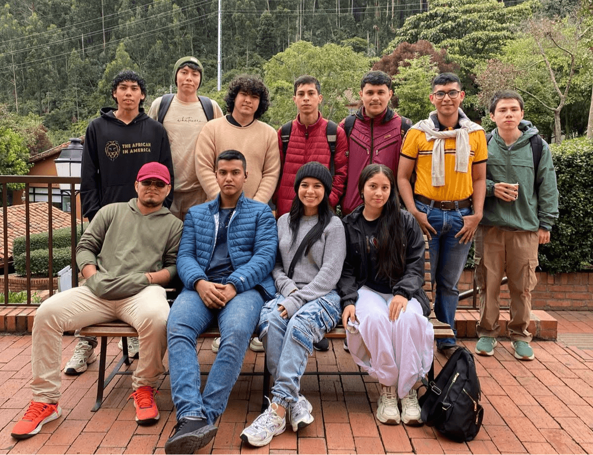

## ¿Qué es Wiki-CP UDLA?

Wiki-CP es una plataforma de referencia y aprendizaje de programación competitiva construida **por el semillero de programación de la Universidad de la Amazonia**, para el semillero y para cualquier latinoamericano que quiera clasificar al ICPC.

Nació de una necesidad real: la información siempre está dispersa, casi siempre en inglés, y el traductor automático no siempre es una buena opción. Aquí encontrarás todo explicado en español, con nuestro propio código y nuestras propias palabras.

---

## ¿Qué vas a encontrar aquí?

Cada tema dentro de la wiki sigue la misma estructura para que siempre sepas qué esperar:

### Contenido de cada tema

1. **Planteamiento del problema** — qué problema resuelve este algoritmo o técnica, y por qué existe.
2. **Explicación de requisitos** — qué debes saber antes de estudiar este tema.
3. **Definición** — qué es exactamente, sin rodeos.
4. **Casos de uso** — cuándo usarlo y cuándo no.
5. **Explicación visual** — diagramas e imágenes hechas en Excalidraw para que lo entiendas gráficamente.
6. **Restricciones** — limitaciones importantes del algoritmo que debes tener en cuenta al competir.
7. **Errores comunes** — los errores que todos cometemos al implementarlo por primera vez.
8. **Código** — implementación lista para usar con nuestras macros.
9. **Explicación del código** — análisis línea por línea *(sección opcional según la complejidad del tema)*.

### Al final de cada tema encontrarás

**Retos** — problemas curados para practicar la técnica, clasificados en tres niveles:

| Nivel | Descripción |
|-------|-------------|
| 🟤 Bronce | Problemas de entrada, ideales para entender la técnica |
| ⚪ Plata | Problemas intermedios |
| 🟡 Oro | Problemas avanzados|

**Material extra** — recursos adicionales para profundizar, con su tipo indicado:

| Tipo | Descripción |
|------|-------------|
| 📹 Video | Explicación en video |
| 📖 Wiki | Artículo o documentación externa |
| 📄 Artículo | Paper o blog técnico |
| 📚 Libro | Capítulo o libro de referencia |

---

## Temáticas

La wiki está organizada en las siguientes categorías, siguiendo el temario necesario para clasificar al ICPC:

### 🔰 Técnicas Básicas
El punto de partida — fundamentos que todo competidor debe dominar antes de avanzar.
Búsqueda binaria, Two pointers, Sliding window, Prefix sums, Greedy, Ordenamiento, y más.

Son las herramientas que aparecen en casi todos los problemas. Dominarlas no es opcional — es el piso mínimo para competir. Un problema que parece difícil muchas veces se reduce a una búsqueda binaria bien aplicada o un greedy bien argumentado.

### 🔢 Matemáticas
Fundamentos matemáticos del competitive programming.
Criba de Eratóstenes, aritmética modular, exponenciación binaria, combinatoria, y más.

El CP vive de las matemáticas. No necesitas ser un matemático, pero sí entender cómo funciona la aritmética modular, cómo contar combinaciones sin listarlas todas, y cómo calcular potencias enormes en microsegundos. Los problemas de matemáticas son de los más frecuentes en la fase regional del ICPC.

### ⚡ Bits
Manipulación de bits — velocidad y elegancia al nivel más bajo.
AND, OR, XOR, shifts, máscaras, bitmask DP, y más.

Trabajar directamente con los bits de un número es una de las habilidades más subestimadas del CP. Permite representar conjuntos de forma compacta, hacer operaciones en tiempo constante y resolver ciertos problemas de DP que serían imposibles de otra manera. Un competidor que domina bits tiene una ventaja silenciosa en casi todas las rondas.

### 📊 DP
Programación dinámica — la técnica más importante del CP.
Mochila, LCS, LIS, Digit DP, DP en árboles, y más.

Si tuviéramos que elegir una sola técnica para estudiar, sería esta. La programación dinámica transforma problemas que parecen imposibles en soluciones elegantes y eficientes. Es también una de las técnicas más exigentes — requiere práctica constante y mucho papel y lápiz antes de escribir código.

### 🔷 Estructuras de Datos
Estructuras avanzadas para resolver problemas eficientemente.
Segment Tree, Fenwick Tree, Trie, Sparse Table, DSU, y más.

A veces el algoritmo está claro pero la solución ingenua es demasiado lenta. Ahí entran las estructuras de datos avanzadas — permiten responder consultas sobre rangos, buscar prefijos o unir componentes en tiempo logarítmico o constante. Conocerlas bien marca la diferencia entre un TLE y un AC.

### 🌿 Grafos
Algoritmos sobre grafos — recorridos, caminos mínimos, árboles y más.
BFS, DFS, Dijkstra, Bellman-Ford, Floyd-Warshall, LCA, HLD, y más.

Los grafos modelan casi cualquier cosa — mapas, redes, dependencias, relaciones. Es una de las categorías más ricas del CP y también una de las más frecuentes en el ICPC. Desde un simple recorrido en anchura hasta algoritmos de camino mínimo en grafos con millones de nodos, esta sección tiene mucho terreno por recorrer.

### 🔤 Strings
Algoritmos sobre cadenas de texto.
KMP, Z-function, Suffix Array, Hashing, Aho-Corasick, y más.

Los problemas de strings suelen parecer sencillos hasta que el tamaño de la entrada te obliga a buscar algo más inteligente que la fuerza bruta. Aquí aprenderás a buscar patrones, comparar subcadenas y procesar texto de forma eficiente — habilidades que marcan la diferencia en rondas avanzadas.

### 🌊 Flujo
Algoritmos de flujo en redes.
Max Flow, Dinic, MCMF, Matching, y más.

Modelar un problema como una red de flujo es uno de los trucos más poderosos del CP. Una vez que lo ves, empiezas a encontrar problemas de matching, asignación y optimización que se resuelven de forma casi directa con estas técnicas. Es una categoría de nicho pero que aparece en competencias de alto nivel con frecuencia.

### 📐 Geometría
Geometría computacional para problemas espaciales.
Convex Hull, Line intersection, Point in polygon, y más.

Los problemas de geometría son los más temidos del ICPC — y con razón. Requieren precisión matemática, manejo cuidadoso de flotantes y una intuición espacial que solo se desarrolla con práctica. Pero también son de los más satisfactorios cuando logras resolverlos. Esta sección te da las herramientas para enfrentarlos con confianza.

---

## ¿Cómo contribuir?

Esta wiki es construida y mantenida por el semillero. Si quieres agregar un tema, corregir un error o mejorar una explicación:

1. Clona el repositorio en GitHub
2. Crea un archivo `nombre-tema.md` dentro de la carpeta de la categoría correspondiente
3. Sigue la estructura de contenido que describimos arriba
4. Abre un Pull Request — tu nombre aparecerá como autor en la página

> **Recuerda:** cada página que escribas le sirve a futuros estudiantes del semillero. Es tu herencia para la universidad.

---

## Meta

Este proyecto nació en **Florencia, Caquetá**, en la Universidad de la Amazonia, con la meta de llevar un equipo al mundial del ICPC. Cada algoritmo que documentamos es un paso más cerca.

> *"Dime y lo olvido, enséñame y lo recuerdo, involúcrame y lo aprendo"*
> — Benjamín Franklin

*Semillero de Programación UDLA · 2026*