Algoritmo de KMP 


soy severo programador
## Problema
Eres un cientifico que esta intentando hallar la cura de un virus a traves de un patron especifico de ADN distribuidos entre Adenina, Citosina, Guanina y Timinas (A, C, G, T) el ADN consta de exactamente mas de 3 millones caracteres en el cual tienes que encontrar el patron dentro del texto q coincida con ACTGGATCGTA. Como lo harias?

La solucion logica y a la vez ingenua que se piensa al principio es comparar caracter por caracter la cadena de texto con el patron, y cuando no halla una coincidencia, retrocedemos todo ese progreso q teniamos y empezamos de nuevo con el patron una casilla mas a la derecha de la cadena de texto, sin embargo, existe una forma mas rapida, efectiva e inteligente la cual podemos implementarla con el algoritmo de KMP
## ¿Que es KMP?
Definimos KMP (Kanuth Morris Pratt), como un algoritmo de busqueda de patrones en una cadena de texto usando una tabla LPS en tiempo O(N + M) siendo N el tamaño del patron y M el tamaño de la cadena

## Requisitos
Antes de empezar este articulo, debes tener claro los siguientes conocimientos 
* Que es un prefijo propio y un sufijo propio de una cadena
* Que es el arreglo LPS (Longest Prefix Suffix) y como se construye
* Nocion basica de Arrays y notacion Big O

## Casos de uso
### Cuando si?
+ Busqueda de un unico patron en textos gigantes: cuando se tratan de cadenas de textos extremadamente gigantes con secuencia altamente repetitivas y solo necesitas buscar un patron en especifico 
+ Procesamiento de Flujo de datos: Si el problema es interactivo o recibes los datos como un flujo continuo el cual no puedes rebobinar ni almacenar por completo en memoria, KMP es clave porque su puntero de lectura de texto jamas se mueve hacia atras 
+ Analisis de prefijos: cuando el problema te pide que en una cadena de texto encontrar la mayor cantidad de ocurrencias de cada prefijo dentro de una misma cadena o en un texto alterno
### Cuando no?
+ Busqueda de multiples patrones simultaneos: Aqui hay que ser muy puntuales en cuanto a que algoritmo usar en este tipo de casos, debido a que varian el problema, si el problema te dice que pueden ser patron de distintos tamaños, lo mejor seria aplicar un Aho-Corasick, pero si te aseguran que los patrones tienen todos la misma longitud, el mejor caso sera aplicar Rabin-Karp 
+ Necesitas hacer muchas comparaciones flexibles entre substrings (varias queries): usa hashing de strings o un suffix array/automaton.
+ El texto cambia dinámicamente entre búsquedas y necesitas estructuras que soporten actualizaciones.

## Explicacion KMP
Como ya definimos KMP como un algoritmo para busqueda de pátrones en una cadena de texto usando tabla LPS, exactamente como funciona graficamente este algoritmo. imaginemos q tenemos la cadena de texto ABABDABACDABABCABAB y un patron ABABAC


Hacemos nuestra comparacion paso a paso hasta que encontramos una falla ahora lo que hace el algortimo es revisar el arreglo lps en la posicion anterior donde las letras no coinciden para saber que tanto podemos reciclar del patron para no desechar todo el progreso


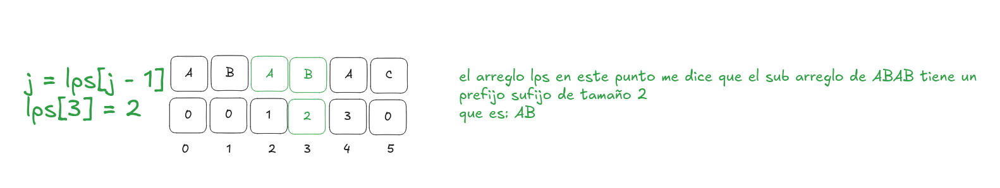

Como el LPS me dice hasta qué punto una parte del patrón es igual a otra parte de sí mismo, esto me permite no reiniciar la comparación desde el principio del patrón tras un fallo. En vez de eso, consulto en el LPS cuál es el prefijo-sufijo más grande de lo que llevaba confirmado hasta el fallo (ABAB), que en este caso es AB (tamaño 2). Como ya sé que esas dos letras coinciden garantizado, corro el patrón dos casillas a la derecha y no vuelvo a comparar AB contra el texto — directamente retomo la comparación desde la letra que sigue después de ese prefijo reciclado (posición j=2 del patrón) contra la misma letra del texto donde había fallado.

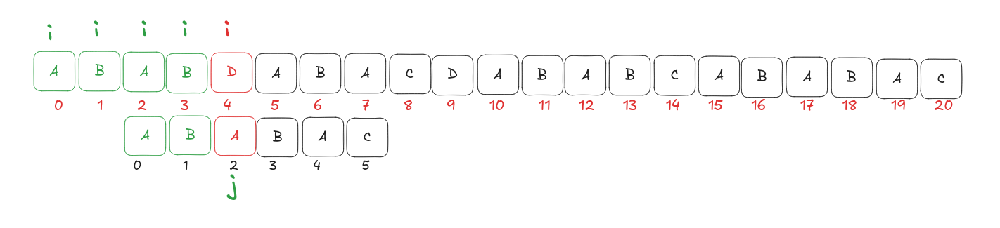

Como la comparacion vuelve a fallar, hacemos el mismo proceso, vamos a lps[ j -1] (lps[2 - 1]) o sea que j va a agarra el valor de lps en la posicion 1 o sea 0, que representa que en la cadena de AB hay unicamente 0 prefijos sufijos iguales entonces j = 0, volvemos a evaluar el patron en el texto desde 0

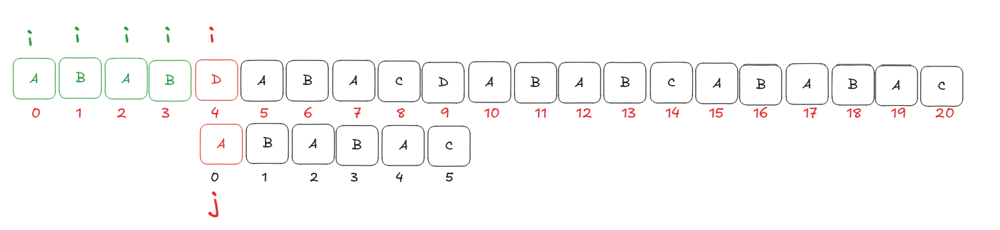
y tenemos un problema, al volver a evaluar el patron desde la posicion 0 y vemos q ya no podemos retroceder mas, eso significa que no hemos podido encontrar un matcheo en esa parte de la cadena de texto lo que implica q tenemos q mover i para seguir evaluando


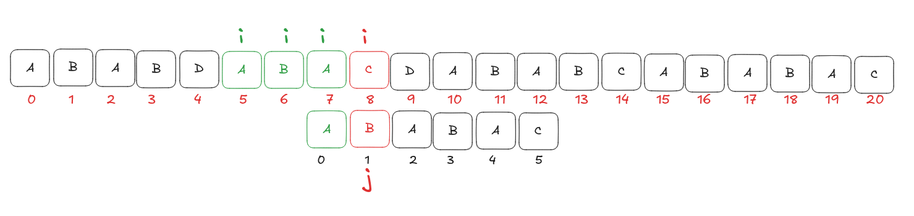


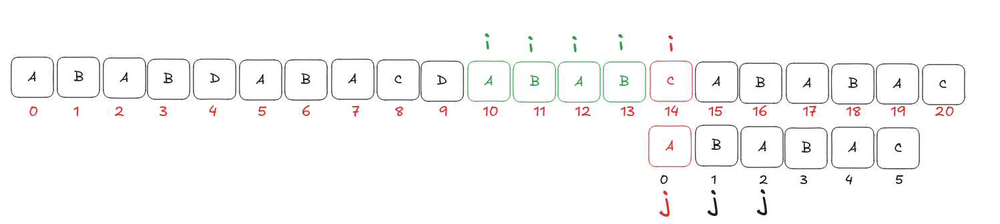
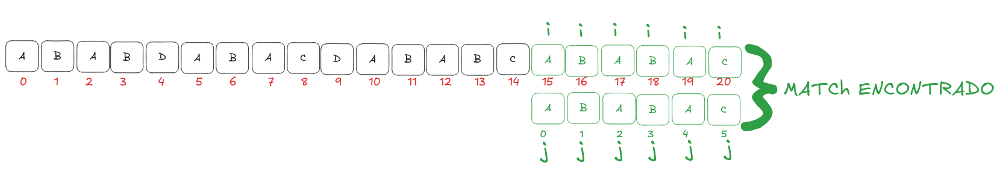

## Restricciones
* Es búsqueda exacta — no admite comodines ni tolerancia a errores (fuzzy matching) sin modificar el algoritmo.
* El LPS se precomputa por patrón. Si necesitas buscar el mismo texto contra muchos patrones distintos, cada uno paga su propio preprocesamiento O(m) — para eso conviene Aho-Corasick en vez de repetir KMP.
* Toda la corrección del algoritmo depende de que el LPS esté bien construido — un error de índice ahí produce falsos negativos silenciosos (no truena, simplemente no encuentra ocurrencias que sí existen).

## Errores Comunes
* Confundir lps[len] con lps[len-1] al saltar tras un fallo. El índice correcto siempre es lps[len - 1], tanto en la construcción como en la búsqueda.
* Olvidar seguir buscando tras el primer match. Si necesitas todas las ocurrencias, después de reportar una debes hacer j = lps[j-1] (no j = 0) y continuar — de lo contrario pierdes ocurrencias que se solapan con la anterior.
* Arrancar la construcción del LPS en i = 0 en vez de i = 1. Con i=0 estarías comparando la primera letra consigo misma, lo cual rompe la tabla desde el inicio.
* No manejar patrones vacíos o más largos que el texto antes de entrar al ciclo principal.
Reconstruir el LPS con el patrón viejo si el patrón cambia entre llamadas (o reutilizar un lps de una ejecución anterior sin recalcularlo).

````cpp
#include <bits/stdc++.h>
using namespace std;

// Construye la tabla LPS del patrón (ya cubierto en el artículo anterior)
vector<int> buildLPS(const string &pattern) {
    int m = pattern.size();
    vector<int> lps(m, 0);
    int len = 0, i = 1;

    while (i < m) {
        if (pattern[i] == pattern[len]) {
            len++;
            lps[i] = len;
            i++;
        } else {
            if (len != 0) {
                len = lps[len - 1];
            } else {
                lps[i] = 0;
                i++;
            }
        }
    }
    return lps;
}

// Búsqueda KMP: devuelve todas las posiciones donde inicia una ocurrencia de 'pattern' en 'text'
vector<int> kmpSearch(const string &text, const string &pattern) {
    int n = text.size(), m = pattern.size();
    vector<int> lps = buildLPS(pattern);
    vector<int> ocurrencias;

    int i = 0, j = 0;
    while (i < n) {
        if (text[i] == pattern[j]) {
            i++;
            j++;
            if (j == m) {
                ocurrencias.push_back(i - j); // encontramos una ocurrencia completa
                j = lps[j - 1];                // seguimos buscando más
            }
        } else {
            if (j != 0) {
                j = lps[j - 1];
            } else {
                i++;
            }
        }
    }
    return ocurrencias;
}

int main() {
    // Caso 1: mismo ejemplo del artículo — no hay ocurrencias
    string texto1 = "ABABDABACDABABCABAB";
    string patron1 = "ABABAC";
    vector<int> res1 = kmpSearch(texto1, patron1);

    cout << "Caso 1: ";
    if (res1.empty()) cout << "no aparece\n";
    else { for (int p : res1) cout << p << " "; cout << "\n"; }

    // Caso 2: mismo patrón aparece dos veces seguidas
    string texto2 = "XYZABABACABABAC";
    string patron2 = "ABABAC";
    vector<int> res2 = kmpSearch(texto2, patron2);

    cout << "Caso 2: ";
    for (int p : res2) cout << p << " ";
    cout << "\n"; // esperado: 3 9
}
````

## ¿Que es LPS? y ¿Porque necesitamos un LPS?
LPS son las siglas de Longest Prefix Suffix, es un arreglo precalculado que nos sirve para registrar las repeticiones internas de un patrón. Para cada índice, te dice exactamente la longitud del prefijo propio más largo que también es un sufijo en esa parte de la cadena. Esto nos sirve para saber como se comporta el patron y que cadenas tienen prefijos y sufijos iguales, al tener prefijos y sufijos iguales, esto quiere decir que no es necesario volver a comparar el patron con el texto desde el principio, sino desde las ultimas letras que son iguales, 
### Ejemplo:
imaginemos el patron ABABAC

gracias al lps, podemos afirmar que por su prefijos y sus sufijos que el prefijo mas largo que su vez es un sufijo es ABA, gracias a esto cuando este comparando el patron con una cadena de texto y las letras no coincidan, no tengo que volver a comparar el patron desde el principio sino revisar mi LPS desde la posción donde no coincide el patron con el texto con el valor del LPS en la posicion anterior 

## ¿Como se construye el arreglo LPS?
Se construye el arreglo LPS a traves de un vector con dos punteros, normalmente nombrados como:
### i: 
Es el puntero que va leyendo la letras del patron y va avisando de cuanto es el tamaño de cada prefijo y sufijo hasta esa parte de la cadena
### len:
Me sirve como otro puntero el cual representa el tamaño del prefijo que estoy comparando con el sufijo

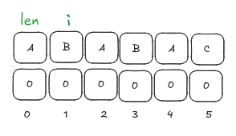
No ponemos a i = 0 debido a que para una subcadena de una sola letra, el único prefijo propio y el único sufijo propio posibles son la cadena vacía (no hay espacio para nada más corto que el total menos 1 carácter). Por eso lps[0] es siempre 0, para cualquier patrón, sin excepción.

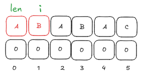
Cadena AB no tiene ningun prefijo sufijo iguales, debido a los sufijos en esta parte es solo B y el prefijo es A el cual no son iguales

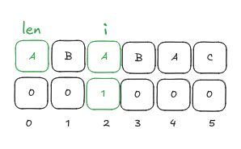

Cadena ABA si tiene prefijos sufijos iguales, debido a que los sufijos en esta parte son: BA, A y los prefijos son: A, AB aqui hay dos iguales que son A, entonces esto lo ponemos en nuestro vvector lps q me dice q hasta esa parte de la cadena solo hay un prefijo sufijo de tamaño 1 que es A y A

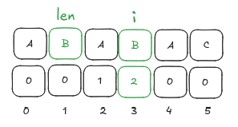

avanzamos len que me dice a mi si el siguiente prefijo q es AB tambien esta como sufijo en la cadena ABAB en este caso si, debido a los prefijos para esta cadena son:
A, AB, ABA
y los sufijos:
B, AB, BAB
aqui hay una coincidencia con AB que es el prefijo q estamos evaluando con len

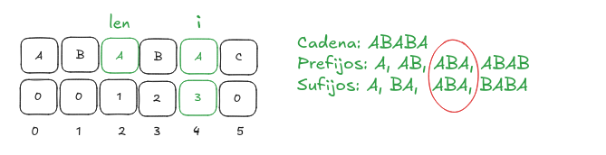
Aqui ya por intuicion sabemos cual es la cadena y su prefijo sufijo mas largo hasta ese momento

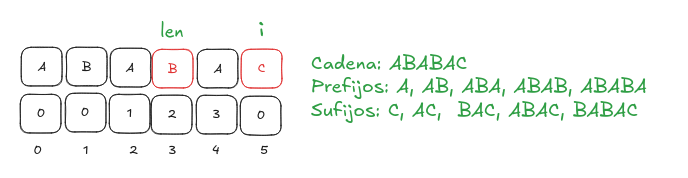

````cpp

#include <bits/stdc++.h>
using namespace std;

int main()
{
    string pattern = "ABABAC";
    int patter_size = pattern.size();
    vector<int> LPS(patter_size,0);
    
    int i = 1, len = 0;
    
    while(i < patter_size){
        if(pattern[i] == pattern[len]){
            len++;
            LPS[i] = len;
            i++;
        }
        else{
            if(len != 0){
                len = LPS[len - 1];
            }
            else{
                LPS[i] = 0;
                i++;
            }
        }
    }
    
    for(int i = 0; i < patter_size; i++){
        cout << pattern[i] << " : " << LPS[i] << endl;
    }

    return 0;
}
````
