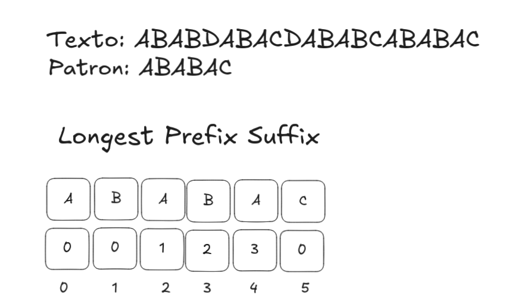
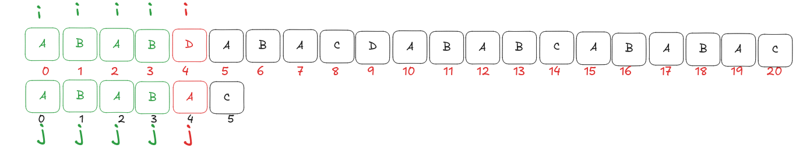
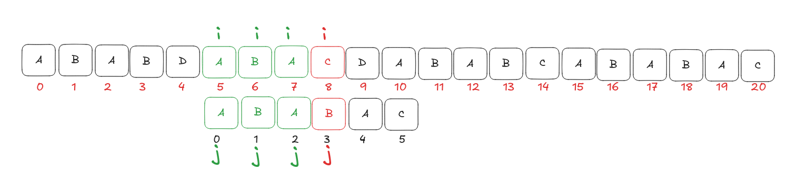
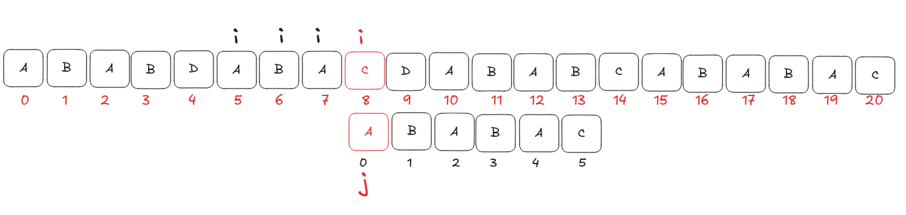
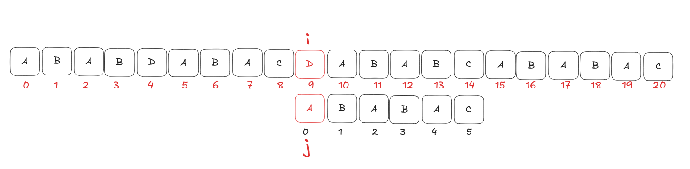
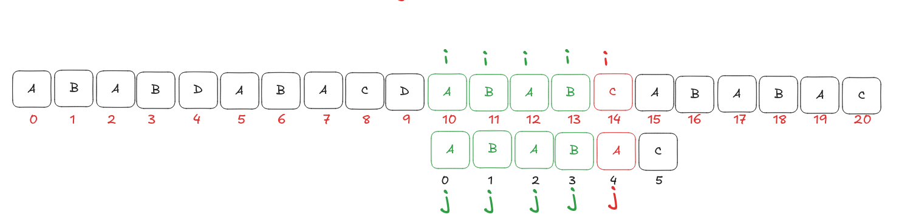
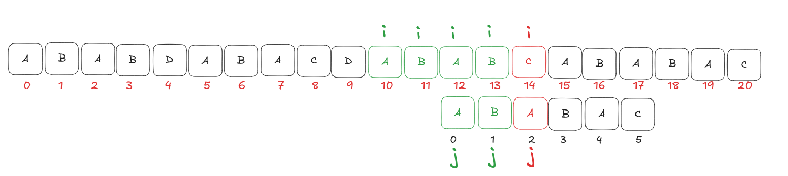

# Algoritmo de KMP

## Problema
Eres un científico que está intentando hallar la cura de un virus a través de un patrón específico de ADN distribuido entre Adenina, Citosina, Guanina y Timina (A, C, G, T). El ADN consta de más de 3 millones de caracteres, en el cual tienes que encontrar un patrón dentro del texto que coincida exactamente con `ACTGGATCGTA`. ¿Cómo lo harías?

La solución lógica, y a la vez ingenua, que se piensa al principio es comparar carácter por carácter la cadena de texto con el patrón, y cuando no haya una coincidencia, retroceder todo ese progreso que teníamos y empezar de nuevo con el patrón una casilla más a la derecha en la cadena de texto. Sin embargo, existe una forma más rápida, efectiva e inteligente, la cual podemos implementar con el algoritmo de KMP.

## ¿Qué es KMP?
Definimos KMP (Knuth-Morris-Pratt) como un algoritmo de búsqueda de patrones en una cadena de texto usando una tabla LPS en tiempo $O(N + M)$, siendo $N$ el tamaño del patrón y $M$ el tamaño de la cadena de texto.

<!-- ## Requisitos
Antes de empezar este articulo, debes tener claro los siguientes conocimientos 
* Que es un prefijo propio y un sufijo propio de una cadena
* Que es el arreglo LPS (Longest Prefix Suffix) y como se construye
* Nocion basica de Arrays y notacion Big O -->

<!-- ## Casos de uso
### Cuando si?
+ Busqueda de un unico patron en textos gigantes: cuando se tratan de cadenas de textos extremadamente gigantes con secuencia altamente repetitivas y solo necesitas buscar un patron en especifico 
+ Procesamiento de Flujo de datos: Si el problema es interactivo o recibes los datos como un flujo continuo el cual no puedes rebobinar ni almacenar por completo en memoria, KMP es clave porque su puntero de lectura de texto jamas se mueve hacia atras 
+ Analisis de prefijos: cuando el problema te pide que en una cadena de texto encontrar la mayor cantidad de ocurrencias de cada prefijo dentro de una misma cadena o en un texto alterno
### Cuando no?
+ Busqueda de multiples patrones simultaneos: Aqui hay que ser muy puntuales en cuanto a que algoritmo usar en este tipo de casos, debido a que varian el problema, si el problema te dice que pueden ser patron de distintos tamaños, lo mejor seria aplicar un Aho-Corasick, pero si te aseguran que los patrones tienen todos la misma longitud, el mejor caso sera aplicar Rabin-Karp 
+ Necesitas hacer muchas comparaciones flexibles entre substrings (varias queries): usa hashing de strings o un suffix array/automaton.
+ El texto cambia dinámicamente entre búsquedas y necesitas estructuras que soporten actualizaciones. -->

## Explicación KMP
Como ya definimos KMP como un algoritmo para búsqueda de patrones en una cadena de texto usando una tabla LPS, veamos exactamente cómo funciona gráficamente este algoritmo. Imaginemos que tenemos la cadena de texto `ABABDABACDABABCABAB` y un patrón `ABABAC`.


*Imagen 0: Vista general del arreglo LPS precalculado para el patrón ABABAC.*

Hacemos nuestra comparación paso a paso hasta que encontramos una falla. Ahora, lo que hace el algoritmo es revisar el arreglo LPS en la posición anterior (donde las letras sí coincidieron) para saber qué tanto podemos reciclar del patrón y no desechar todo el progreso.


*Momento 1: Los punteros `i` (texto) y `j` (patrón) avanzan juntos hasta el índice 4. Aquí ocurre una falla: el texto tiene una 'D' y el patrón una 'A'. El progreso validado hasta ahora es la cadena 'ABAB'.*


*Momento 2: Consultamos el arreglo LPS. Como el fallo fue en `j = 4`, miramos el índice anterior `j - 1`. `lps[3]` nos da un valor de 2, lo que significa que el prefijo-sufijo más largo de la cadena que ya habíamos verificado ('ABAB') es 'AB'.*

Como el LPS me dice hasta qué punto una parte del patrón es igual a otra parte de sí mismo, esto me permite no reiniciar la comparación desde el principio del patrón tras un fallo. En vez de eso, consulto en el LPS cuál es el prefijo-sufijo más grande de lo que llevaba confirmado hasta el fallo (`ABAB`), que en este caso es `AB` (tamaño 2). Como ya sé que esas dos letras coinciden garantizado, corro el patrón dos casillas a la derecha y no vuelvo a comparar `AB` contra el texto — directamente retomo la comparación desde la letra que sigue después de ese prefijo reciclado (posición `j = 2` del patrón) contra la misma letra del texto donde había fallado (`i = 4`).


*Momento 3: Se retoma la comparación. Ahora evaluamos la letra 'D' del texto (`i = 4`) con la letra en `j = 2` del patrón ('A'). Ocurre una nueva divergencia.*

Como la comparación vuelve a fallar, hacemos el mismo proceso: vamos a `lps[j - 1]`, o sea `lps[2 - 1]`. Entonces `j` va a tomar el valor de `lps[1]`, que es 0. Esto representa que en la cadena `AB` hay únicamente 0 prefijos-sufijos iguales, por lo que `j = 0`. Volvemos a evaluar el patrón contra el texto desde la posición 0.


*Momento 4: El puntero `j` retrocede a 0. Comparamos 'D' en el texto contra 'A' en el patrón. Vuelve a fallar.*

Y tenemos un problema: al volver a evaluar el patrón desde la posición 0, vemos que ya no podemos retroceder más. Esto significa que no hemos podido encontrar una coincidencia parcial posible en esta parte de la cadena, lo que implica que debemos avanzar el puntero `i` en el texto para seguir evaluando.


*Momento 5: Al no haber similitudes posibles, el puntero `i` en el texto se ve obligado a avanzar y continuar la lectura de los siguientes caracteres, empezando una nueva racha de aciertos ('ABA').*


*Momento 6: El puntero avanza hasta el índice `i = 8` (letra 'C') y `j = 3` (letra 'B'). Se detecta un nuevo fallo en el texto.*


*Momento 7: Nuevamente evitamos desechar el proceso. Recurrimos a `lps[2]` (que es 1), por lo que `j` baja a 1. Comparamos la 'C' contra la 'B'. Falla de nuevo.*


*Momento 8: Al fallar, consultamos `lps[0]` que es 0. El puntero `j` retrocede hasta 0. Se compara la 'C' del texto contra la 'A' del patrón. Otra falla.*


*Momento 9: Habiendo agotado las opciones en el patrón (`j = 0`), obligatoriamente debemos correr el texto avanzando `i` a la posición 9 (letra 'D'). La 'D' choca nuevamente contra la 'A', forzando a `i` a seguir moviéndose.*


*Momento 10: Eventualmente `i` avanza logrando una excelente racha (`ABABA`). Al llegar a la 'C' del texto en `i = 14`, y compararla contra la 'A' en `j = 4` del patrón, vuelve a ocurrir un fallo, listo para activar nuevamente el reciclaje mediante la tabla LPS.*

<!-- ## Restricciones
* Es búsqueda exacta — no admite comodines ni tolerancia a errores (fuzzy matching) sin modificar el algoritmo.
* El LPS se precomputa por patrón. Si necesitas buscar el mismo texto contra muchos patrones distintos, cada uno paga su propio preprocesamiento O(m) — para eso conviene Aho-Corasick en vez de repetir KMP.
* Toda la corrección del algoritmo depende de que el LPS esté bien construido — un error de índice ahí produce falsos negativos silenciosos (no truena, simplemente no encuentra ocurrencias que sí existen).

## Errores Comunes
* Confundir lps[len] con lps[len-1] al saltar tras un fallo. El índice correcto siempre es lps[len - 1], tanto en la construcción como en la búsqueda.
* Olvidar seguir buscando tras el primer match. Si necesitas todas las ocurrencias, después de reportar una debes hacer j = lps[j-1] (no j = 0) y continuar — de lo contrario pierdes ocurrencias que se solapan con la anterior.
* Arrancar la construcción del LPS en i = 0 en vez de i = 1. Con i=0 estarías comparando la primera letra consigo misma, lo cual rompe la tabla desde el inicio.
* No manejar patrones vacíos o más largos que el texto antes de entrar al ciclo principal.
* Reconstruir el LPS con el patrón viejo si el patrón cambia entre llamadas (o reutilizar un lps de una ejecución anterior sin recalcularlo). -->

```cpp
#include <bits/stdc++.h>
using namespace std;

// Construye la tabla LPS del patrón (ya cubierto en el artículo anterior)
vector<int> buildLPS(const string &pattern) {
    int m = pattern.size();
    vector<int> lps(m, 0);
    int len = 0, i = 1;

    while (i < m) {
        if (pattern[i] == pattern[len]) {
            len++;
            lps[i] = len;
            i++;
        } else {
            if (len != 0) {
                len = lps[len - 1];
            } else {
                lps[i] = 0;
                i++;
            }
        }
    }
    return lps;
}

// Búsqueda KMP: devuelve todas las posiciones donde inicia una ocurrencia de 'pattern' en 'text'
vector<int> kmpSearch(const string &text, const string &pattern) {
    int n = text.size(), m = pattern.size();
    vector<int> lps = buildLPS(pattern);
    vector<int> ocurrencias;

    int i = 0, j = 0;
    while (i < n) {
        if (text[i] == pattern[j]) {
            i++;
            j++;
            if (j == m) {
                ocurrencias.push_back(i - j);  // encontramos una ocurrencia completa
                j = lps[j - 1];                // seguimos buscando más
            }
        } else {
            if (j != 0) {
                j = lps[j - 1];
            } else {
                i++;
            }
        }
    }
    return ocurrencias;
}

int main() {
    // Caso 1: mismo ejemplo del artículo — no hay ocurrencias
    string texto1 = "ABABDABACDABABCABAB";
    string patron1 = "ABABAC";
    vector<int> res1 = kmpSearch(texto1, patron1);

    cout << "Caso 1: ";
    if (res1.empty()) cout << "no aparece\n";
    else { for (int p : res1) cout << p << " "; cout << "\n"; }

    // Caso 2: mismo patrón aparece dos veces seguidas
    string texto2 = "XYZABABACABABAC";
    string patron2 = "ABABAC";
    vector<int> res2 = kmpSearch(texto2, patron2);

    cout << "Caso 2: ";
    for (int p : res2) cout << p << " ";
    cout << "\n"; // esperado: 3 9
}
```