## Problema
Trabajas en el equipo de seguridad de una empresa. Cada noche llegan varios gigabytes de logs de acceso, y hay un patrón de ataque conocido — una secuencia exacta de comandos — que un grupo de hackers repite una y otra vez, mezclada entre millones de líneas inofensivas. Tu jefe te pide: "necesito que encuentres TODAS las veces que aparece ese patrón, esta noche, antes de que vuelvan a atacar." Comparar el patrón contra cada posible punto de inicio del log, letra por letra, tardaría horas. ¿Cómo lo harías en segundos?


## ¿Que es el algoritmo Z y por que se llama Z?
El algoritmo Z es un algoritmo que dado una cadena de texto S calcula una lista de numeros en un arreglo (llamado Z) el cual nos dice que
desde cualquier posicion de la cadena de i (excepto 0) cuantas letras coinciden con el principio de la cadena

## ¿Principio de la Cadena, desde cualquier posicion de i cuantas letras coinciden?
si, al principio es un poco confusa la explicacion del algoritmo Z principalmente por estas dos preguntas, a que nos referimos con el principio de la cadena?
en muchos articulos te van a mencionr a acerca de "el principio" pero esto no se refiere a mas que desde una subcadena que empieza desde una posicion i hasta n (siendo i > 0) cuantas letras coinciden con la subcadena de i = 0 hasta n - i, visualmente lo podemos ver de la siguiente manera

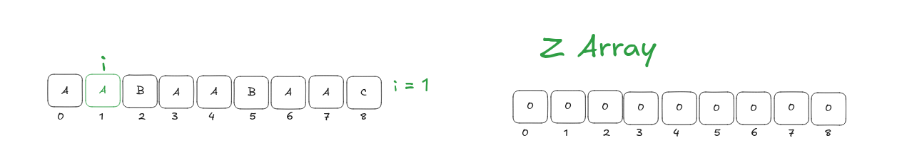

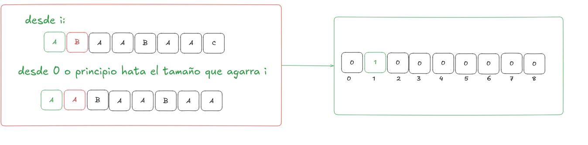

aqui solo hay una coincidencia y es en su primer posicion, entonces decimos que Z array en la posicion de i va a ser la cantidad de letras que coinciden

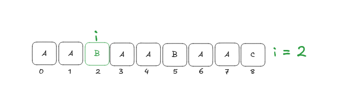

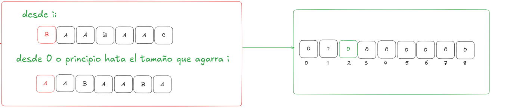

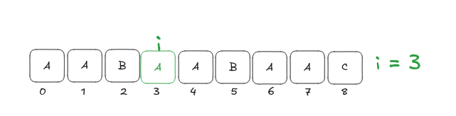

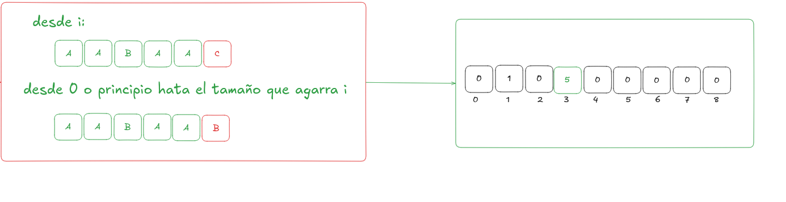

aqui hay muchas letras que coinciden, exactamente 5, o sea Z[i] = 5

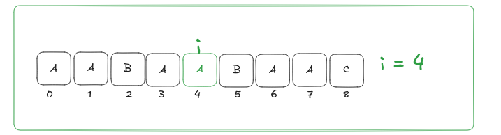

Ahora bien, aqui surge una cuestion, y es que lo q hemos hecho hasta ahora ha sido muy lento, ir agarrando cada subcadena desde i y otra desde el inicio 
produce que esto sea muy lento, hasta que llegamos a esta parte, cuando teniamos i = 3 vimos q había 5 letras que encajaban perfectamente, desde la posición 3 hasta la posición 7 — la coincidencia se rompió justo al llegar a la posición 8, aqui surge nuestro concepto de reciclaje, debido a que ahora estamos en i = 4 podemos decir que estamos dentro del rango que hicimos anteriormente (i = 3, i = 7 hasta la 7ma posicion teniamos un matcheo perfecto) y esta consulta se encuentra dentro de ese rango podemos reciclar lo q ya hicimos? efectivamente pero de que manera? como funciona el reciclaje aqui? imaginemonos que el rango de i = 3 hasta i = 7 es una ventana para efectos practicos vamos a dejar esta ventana como dos punteros L y R (L = 3, R = 7) 

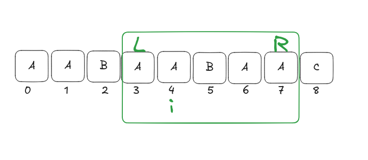

en lugar de estar haciendo el matcheo que estabamos poniendo en practica, podemos consultar el arreglo Z en estos cuando tenemos un i dentro de un rango L R que ya conocemos, y consultamos de la siguiente manera: al i estar dentro de esta venta podemos podemos calcular una ventana espejo de la siguiente manera:
k = i - L
Por que esta resta?
Relaizamos esta resta debido a que como el rango L y R es una copia exacta del principio de de la cadena

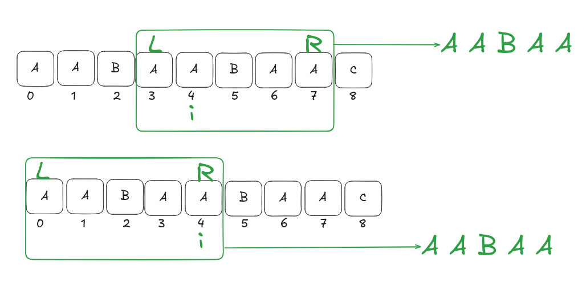

entonces decimos que su semejante se encuentra en la posicion de k = i - L (k = (4 - 3) = 1)

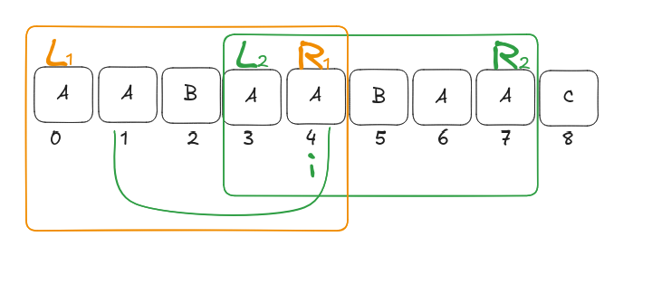

podemos ver que en la posicion de 1 del sub arreglo de i = 3 es igual a la posicion 1 de incio del arreglo en i = 0 
como k es una posicion anterior de i, eso significa que ya previamente lo habiamos calculado en Z (Z[i - L] = Z[4 - 3] = Z[1])

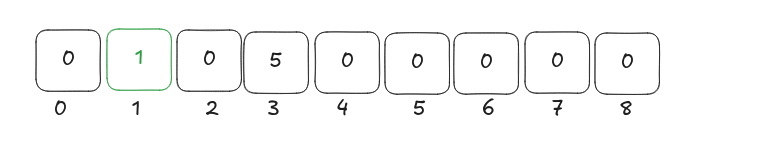

Peeero no podemos copiar Z[k] a ciegas hay q compararlo contra cuantas casillas de verificado de la ventana me queda por delante, en este caso serian 4, para saber esto hay una forma y es 
(espacio_restante = (R-i+1)) en este caso (espacio_restante = 7 - 4 + 1 = 4) y por que es necesario hacer esto? pq a la hora de consultar mi arreglo de Z y hacer este
* Que Z[k] < espacio_restante:el corte que ya conocías (dónde se rompió la coincidencia en k) cabe completo dentro de tu ventana verificada. Como la ventana es una copia exacta del principio, ese mismo corte tiene que repetirse también en i, garantizado. No compares nada: Z[i] = Z[k], directo.
* Que Z[k] > espacio_restante: el valor que conoces se sale (o llega justo al borde) de lo que tu ventana te garantiza. Más allá de R es territorio nunca comparado, así que no puedes confiar ciegamente. Lo único seguro es que coincide hasta R (eso son espacio_restante letras). De ahí en adelante, tienes que
volver a comparar letra por letra, empezando justo en la posición R + 1, hasta encontrar la primera diferencia (o el final de la cadena). Si esa extensión llega más lejos que el R anterior, actualizas la ventana: el nuevo L pasa a ser i, y el nuevo R pasa a ser la nueva posición donde se rompió menos uno.

Resumido en una sola fórmula, esto es lo que casi todo material sobre el algoritmo Z escribe como:

candidato = min(Z[k], R - i + 1)

Y la regla es: si candidato es estrictamente menor que espacio_restante, ya terminaste, ese es tu Z[i]. Si candidato es igual a espacio_restante (o sea, tocaste el borde de la ventana), no puedes quedarte con eso como respuesta final — tienes que seguir comparando manualmente desde R+1 para ver si se extiende más.

````cpp

#include <bits/stdc++.h>
using namespace std;

int main()
{
	string s = "AABAABAAC";
	int n_s = s.size();
	vector<int> Z(n_s, 0);

	int L = 0, R = 0;

	for(int i = 1; i < n_s; i++) {
		if(i > R) {
			L = R = i;  //L = 1, R = 1
			while(R < n_s && s[R - L] == s[R]) {
				R++;
			}
			Z[i] = R - L;
			R--;
		}
		else {
			int k = i - L;
			int restante = R - i + 1;
			if(Z[k] < restante) {
				Z[i] = Z[k];
			}
			else {
				L = i;
				R = i + restante - 1;
				while (R < n_s && s[R - L] == s[R]) {
					R++;
				}
				Z[i] = R - L;
				R--;
			}
		}
	}
	
	for(auto c: Z){
	    cout << c << " ";
	}

	return 0;
}

````